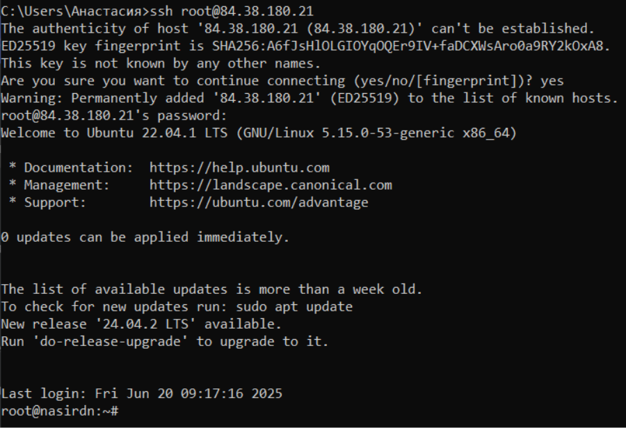
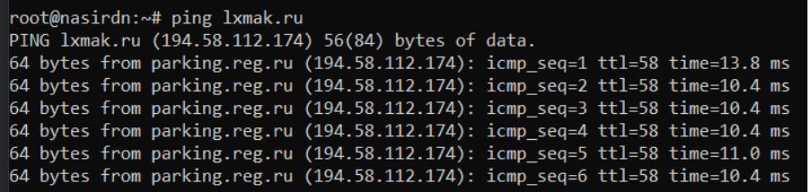
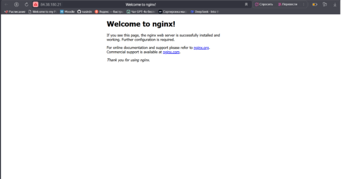
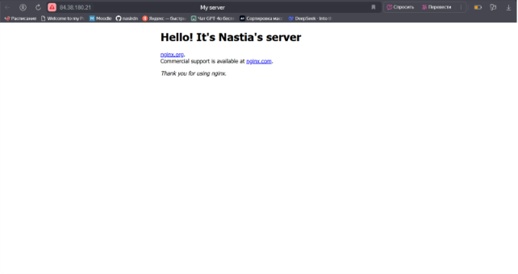

## Лабораторная работа №2. Создание и настройка VDS, подключение к серверу
## Закаблукова Анастасия, ИВТ-1.1

1. Подключение через SSH к серверу.  

2. Ping до сервера (по имени).  

3. Сайт.  
  
