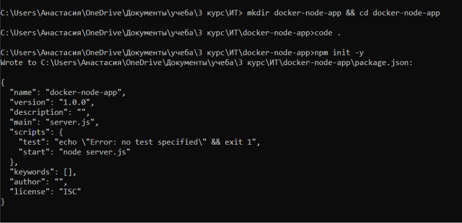
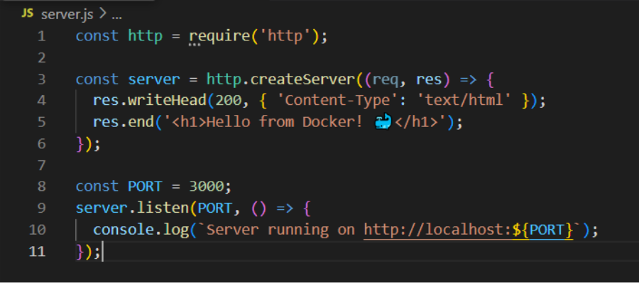
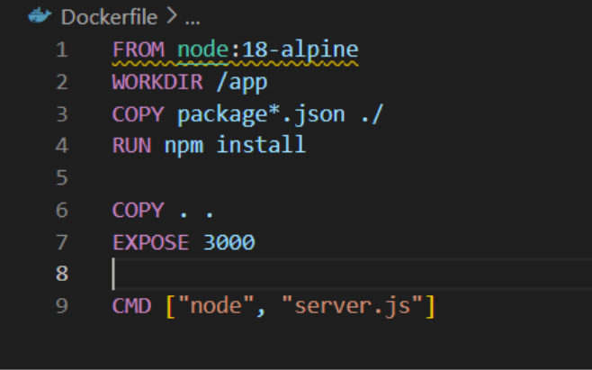
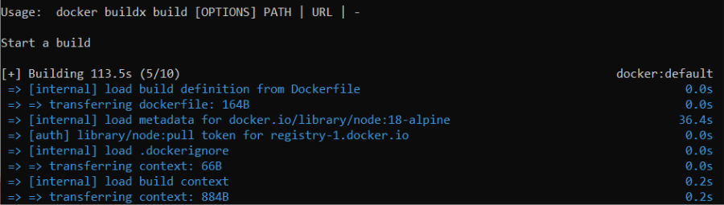
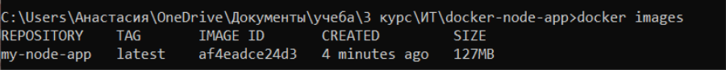
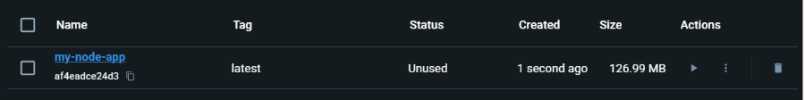
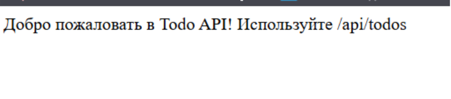
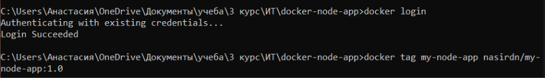
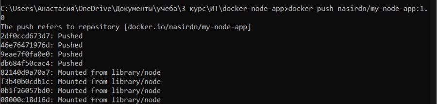

## Лабораторная работа №5. Docker BPR
## Закаблукова Анастасия, ИВТ-1.1

Ссылка: https://hub.docker.com/r/nasirdn/my-node-app 

Инициализация Node.js проекта и создан файл package.json с базовой конфигурацией.  
 

Создан простой веб-сервер.  
 

Создан Dockerfile.
 

Процесс сборки Docker-образа командой docker build.  
 

Просмотр списка Docker-образов на компьютере после сборки.  
 

Информация о Docker-образе в программе Docker Desktop.  
 

Приложение запущено и работает в Docker-контейнере.  
 

Подготовка к загрузке образа на Docker Hub.  
 

Успешная загрузка Docker-образа на Docker Hub.  
 