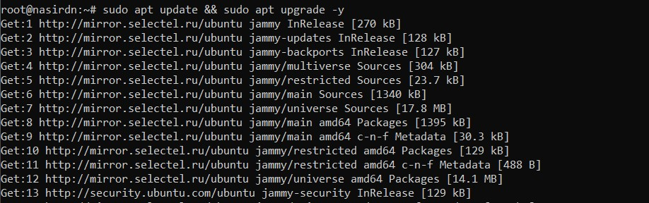
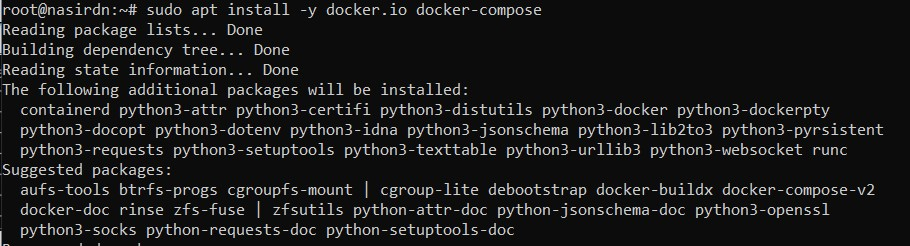
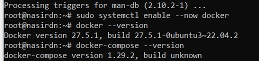
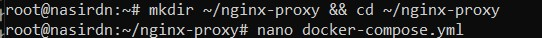
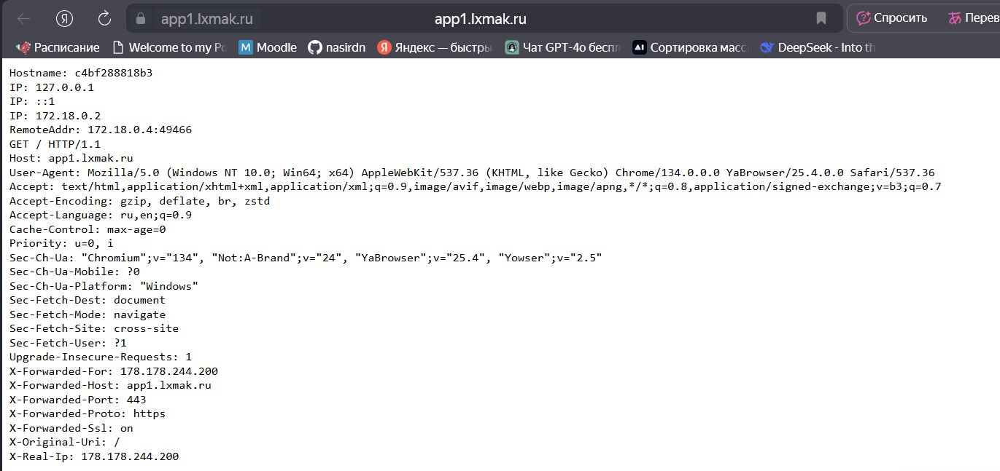

## LetsEncrypt & Nginx Proxy
## Закаблукова Анастасия, ИВТ-1.1

1. Обновление системы
  

2. Установка Docker и Docker Compose 
 
 

3. Создаем docker-compose.yml  
 

[docker-compose.yml](docker-compose.yml)  
4. Создаем папки  
 

5. Поднимаем контейнер
 

6. Результат  

app1:
  

app2:
 
