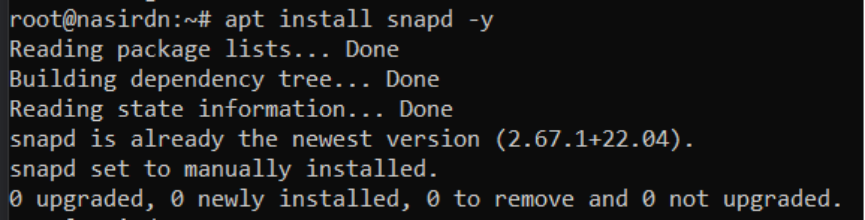
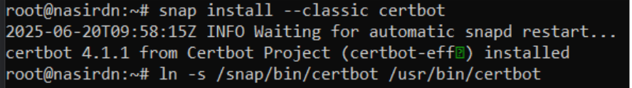
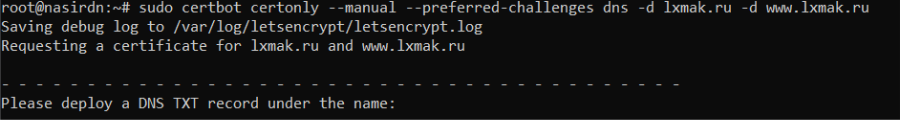
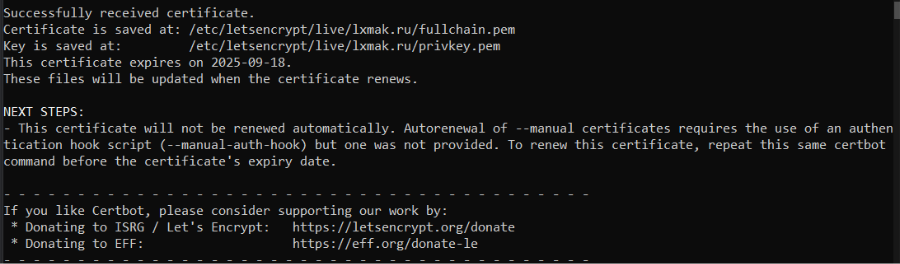
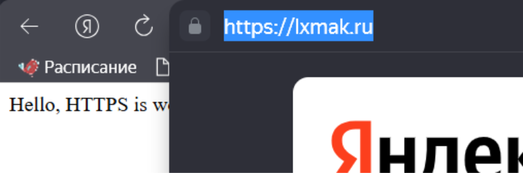

## Лабораторная работа №3. Получение сертификата Let's encrypt для Nginx (без Docker)
## Закаблукова Анастасия, ИВТ-1.1
 
Установка менеджера пакетов Snapd на сервере.  

 
Установка Certbot через Snap и создание симлинка.  

 
Начало процесса получения SSL-сертификата Let's Encrypt с DNS-проверкой.  
  

SSL-сертификат Let's Encrypt успешно получен.  
  

Успешная работа сайта по HTTPS с SSL-сертификатом.  
