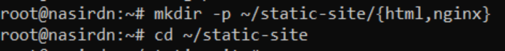
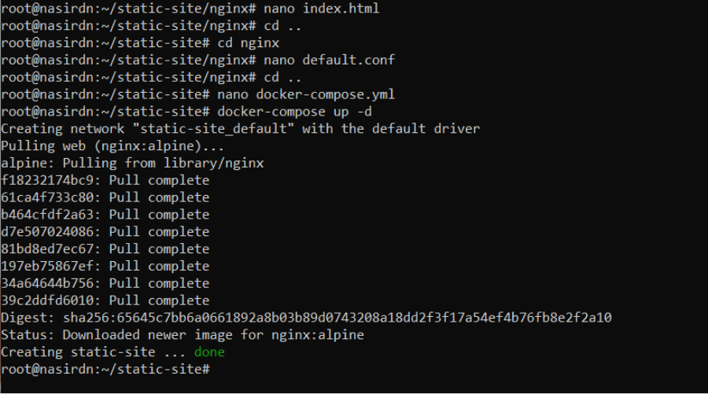
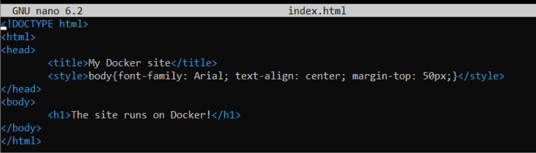
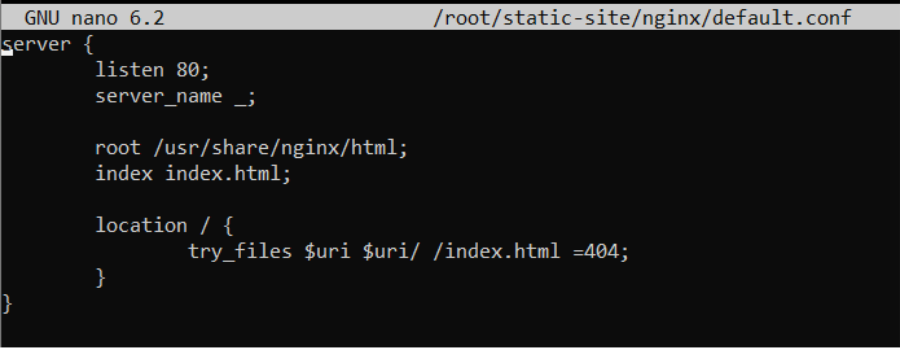
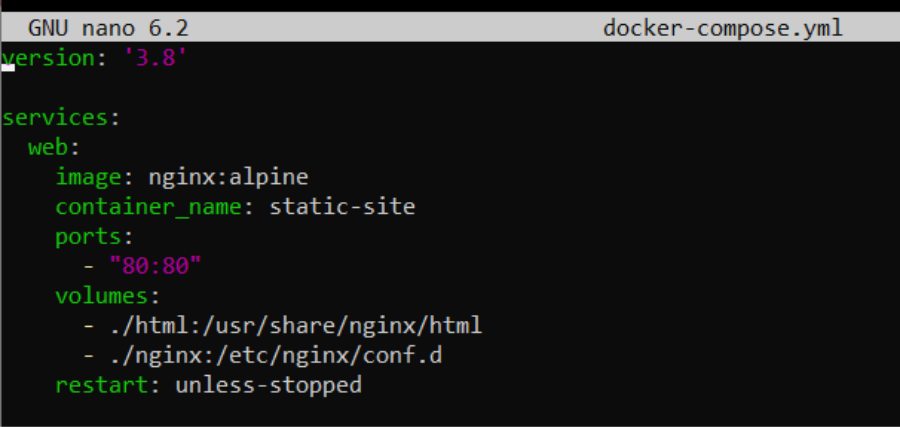
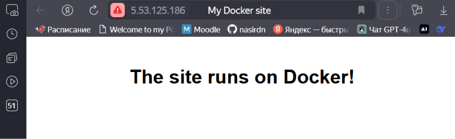

## Лабораторная работа №4. Установка докера и запуск статичного сайта.
## Закаблукова Анастасия, ИВТ-1.1
 
 Создание структуры папок для статического сайта.  

 
Создание и запуск Docker-контейнера со статическим сайтом на Nginx.  

 
HTML-код главной страницы статического сайта.  
  

Конфигурационный файл Nginx для Docker-контейнера.  
  

Файл Docker Compose для запуска статического сайта.  

Работающий статический сайт в браузере.  
