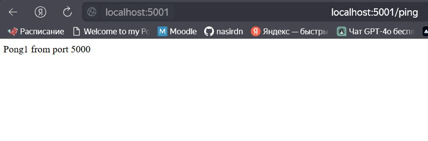
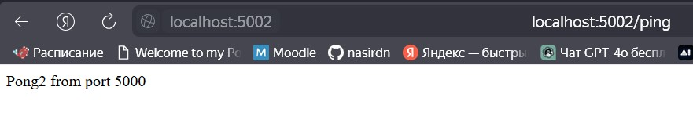
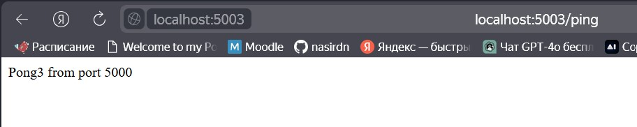
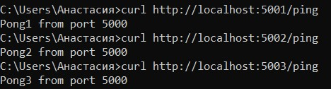

## Docker-Compose First Look
Задание:
1. Разработать небольшое в стиле Ping Pong приложение на Python
2. Составить docker-compose файл для 2+ экземпляров приложения. Каждый из них должен быть на определенном порту и собственным Pong-ответом
3. Продемонстрировать:
- приложение
- docker-compose.yml
- работу приложения (браузер, curl)

[код приложения](app.py)
- Убеждаемся, что docker и docker-compose установлены
- Реализуем структуру  
ping-pong-app/  
├── [app.py](app.py)  
├── [Dockerfile](Dockerfile)  
├── [docker-compose.yml](docker-compose.yml)  
└── [requirements.txt](requirements.txt)
- Собираем и запускаем контейнер

В [docker-compose.yml](docker-compose.yml) развертывается три экземпляра. Каждый имеет свой порт (5001, 5002, 5003) и уникальный ответ (Pong1, Pong2, Pong3).
Приложение автоматически перезапускается при ошибках из за использования restart: always

Работа приложения через браузер:  
  
  
  

Работа приложения через curl:  
