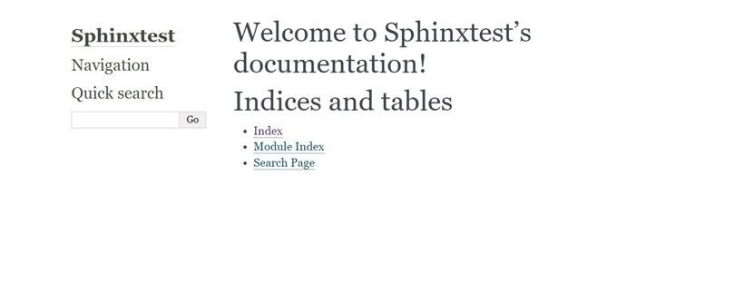

## Лабораторная работа №10
---
1. Установка Sphinx 
```
pip install sphinx
```
2. Основа документации
```
sphinx-quickstart
```
3. Разделяем каталоги на build и source
4. Создаем html основу
```
sphinx-build -b html source _build\html
```
5. Запускаем сервер
```
python -m http.server 8000
```

Результат:
