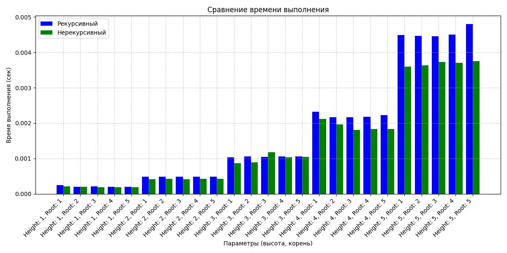

# Лабораторная работа № 2
## Закаблукова Анастасия Эдуардовна, ИВТ-1.1

В ходе работы над ЛР была проведена реализация и сравнение двух подходов к построению 
бинарного дерева: рекурсивного и нерекурсивного. Для этого были созданы два 
модуля: rec_tree.py с рекурсивной функцией и nonrec_tree.py с нерекурсивной функцией.

[Рекурсивная реализация](rec_tree.py)

[Нерекурсивная реализация](nonrec_tree.py)

### Результаты
Для тестирования использовались различные комбинации высоты (1-5) и корня (1-5).

Рекурсивная реализация:
+ Лаконичный код;
+ Легко читаемый код;

- При больших значениях может возникнуть переполнение стека;
- Время выполнения увеличивается из-за накладных расходов на вызовы функций.

Нерекурсивная реализация:
+ Эфективна для больших высот;
+ Стабильная производительность;

- Код менее интуитивен;
- Не всегда быстрее на малых данных.

График:
