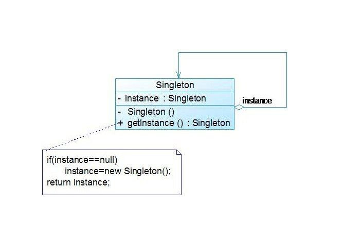

Выполнили: Закаблукова А.Э. и Кочеткова М.П.

## _Паттерн "Одиночка"_

Одиночка (от англ. Singleton) - порождающий шаблон проектирования, гарантирующий, что в однопоточном приложении будет единственный экземпляр некоторого класса, и предоставляющий глобальную точку доступа к этому экземпляру.

---

Цель шаблона Singleton:
- Обеспечение создания одного и только одного объекта класса.
- Предоставление точки доступа для объекта, который является глобальным для программы.
- Контроль одновременного доступа к ресурсам, которые являются общими.

Применение:
- Конфигурационные настройки.
- Подключение к базе данных.
- Логирование.
- Счётчики и глобальные объекты.
- Пул ресурсов.

---



Плюсы:
- Наведение порядка в глобальном пространстве имён.
- Ускорение начального запуска программы, если есть множество одиночек, которые не нужны для запуска.
- Упрощение кода инициализации — система автоматически неявно отделит нужные компоненты от ненужных и проведёт топологическую сортировку.
- Одиночку можно в дальнейшем превратить в шаблон-стратегию или несколько таких объектов.

Минусы:
- Усложняется контроль за межпоточными гонками и задержками.
- Требуются особые функции для модульного тестирования, чтобы физически изолировать тесты.
- ребуется особая тактика тестирования готовой программы, ведь пропадает даже понятие «простейшая запускаемость» — запускаемость зависит от конфигурации.
- Маленький объект без данных.
- Компоненты не должны иметь неявных связей между собой, иначе небольшое изменение в программном коде, файле настроек, сценарии пользования может спутать порядок и вызвать трудноуловимую ошибку.

---

Базовый шаблон Singleton:
```python
class Singelton:
_instance = None

def __new__(cls):
    if cls._instance is None:
        cls._instance = super(Singelton, cls).__new__(cls)
    return cls._instance
```

В шаблоне происходит создание экземпляра, при условии, что он ещё не создан. Приватный конструктор new гарантирует, что экземпляр класса можно создать только внутри самого класса. После чего происходит возвращение либо созданного ранее экземпляра, либо созданного только что.
