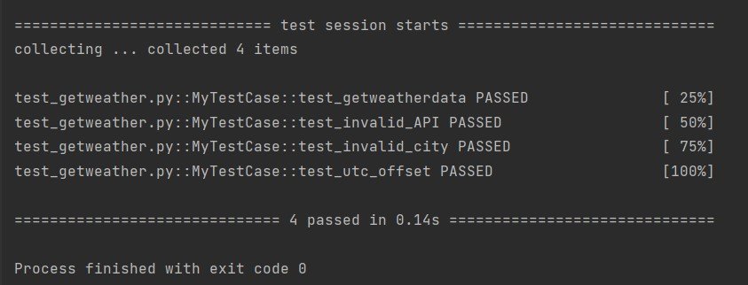

# Закаблукова Анастасия Эдуардовна ИВТ-1.1
## Лабораторная работа №2. Использование API openweathermap.org.

Написать реализацию функции get_weather_data(place, api_key=None) (в модуле getweatherdata), в которой необходимо 
получить данные о погоде с сайта https://openweathermap.org/.

Функция должна возвращать объект в формате JSON, включающий:

- информацию о названии города (в контексте openweathermap)
- код страны (2 символа)
- широту и долготу, на которой он находится
- его временной зоне
- а также о значении температуры (как она ощущается)

Код:   
[код функции get_weather_data](getweatherdata.py)

В файле own_my_key.py записан API_key. Этот файл добавлен в .gitignore

Код запуска:  
```python
if __name__ == '__main__':
    city = input('Введите город на английском: ')
    get_weather_data(city, key)
```

Возвращается строка json:
```
{
    "name": "Moscow",
    "country": "RU",
    "coord": {
        "lon": 37.6156,
        "lat": 55.7522
    },
    "timezone": "UTC+3",
    "temperature": -1.82,
    "feels_like": -7.44
}
```

Проверяем работу с городами:
- Санкт-Петерсбург
```
{
    "name": "Saint Petersburg",
    "country": "RU",
    "coord": {
        "lon": 30.2642,
        "lat": 59.8944
    },
    "timezone": "UTC+3",
    "temperature": -2.19,
    "feels_like": -8.23
}
```
- Чикаго
```
{
    "name": "Chicago",
    "country": "US",
    "coord": {
        "lon": -87.65,
        "lat": 41.85
    },
    "timezone": "UTC-6",
    "temperature": -13.95,
    "feels_like": -19.82
}
```
- Дакка
```
{
    "name": "Dhaka",
    "country": "BD",
    "coord": {
        "lon": 90.4074,
        "lat": 23.7104
    },
    "timezone": "UTC+6",
    "temperature": 19.99,
    "feels_like": 19.95
}
```

## Тесты
* Тест на проверку функции get_offset (преобразовование в формат UTC;
* Тест на проверку функции get_weather_data (получение данных о определенном городе - Лондон);
* Тест на проверку функции get_weather_data (получение ошибки при вводе неверного города);
* Тест на проверку функции get_weather_data (получение ошибки при вводе неверного API).


