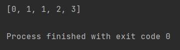
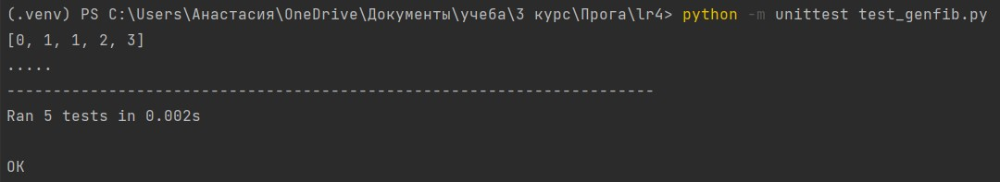
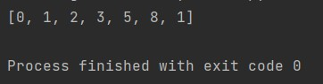
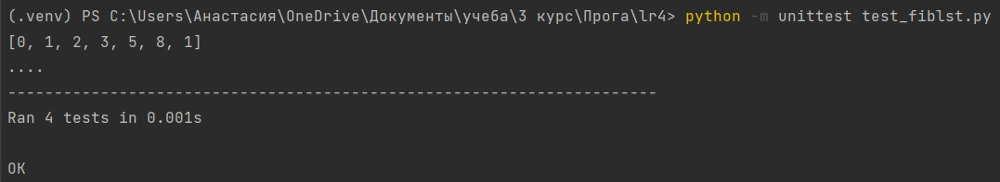

# Закаблукова Анастасия Эдуардовна ИВТ-1.1
## Лабораторная работа №4. Создание генератора с элементами ряда Фибоначчи.

Часть 1. Создание сопрограммы на основе кода, позволяющей по данному n сгенерировать список элементов из ряда Фибоначчи.

[код программы](gen_fib.py)

Также были написаны тесты для этой программы.

[Тесты](test_genfib.py)

Результат программы:  

Результат тестов:  

Часть 2. Создание программы, возвращающей список чисел Фибоначчи с помощью итератора.

[код программы](fiblist.py)

Также были написаны тесты для этой программы.

[Тесты](test_fiblst.py)

Результат программы:  

Результат тестов:  
