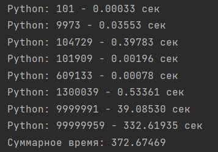
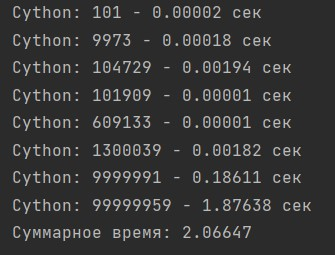
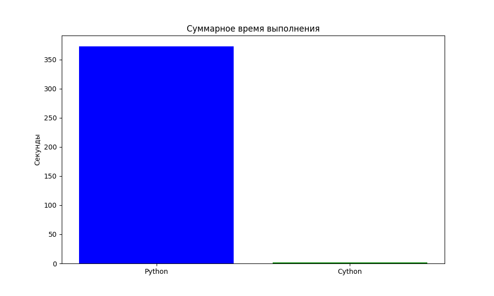
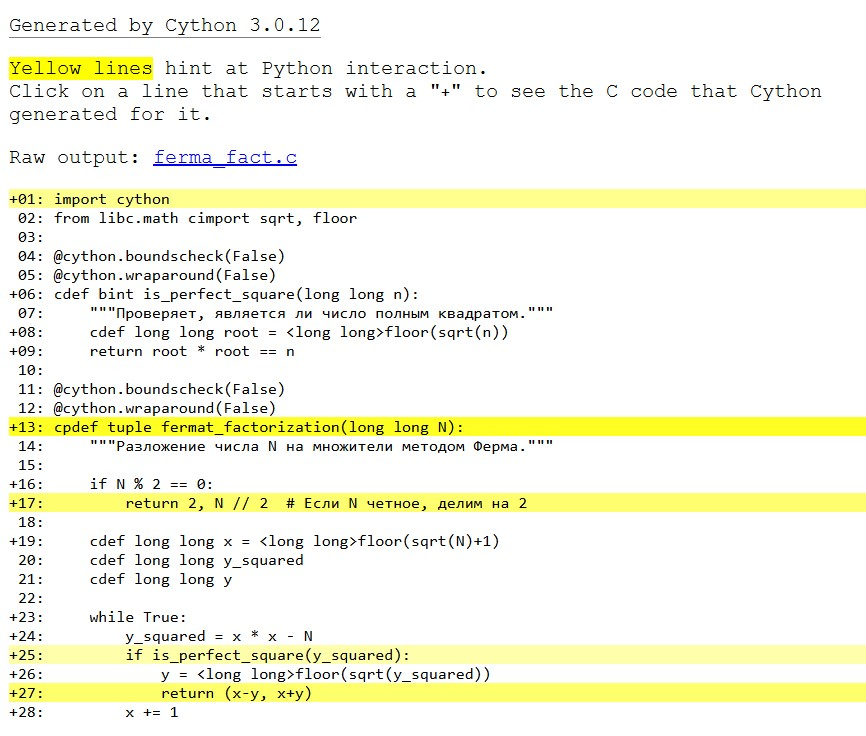

# Закаблукова Анастасия Эдуардовна ИВТ-1.1
## Лабораторная работа №6. Cython.

*Цель:*
- Оставив представленный код на Python, переписать функции для нахождения чисел с помощью Cython;
- Запустить timeit с аналогичными параметрами и сравнить два варианта, построить график;
- С помощью annotate=True сгенерируйте html (где визуализировано взаимодействие с Python-интерпретатором) и приложите его к отчету. 

Код на Python:
[код программы](ferfact.py)

Код на Cython:
[код программы](ferma_fact.py)

Времена выполнения на Python:

Времена выполнения на Cython:

График с общим временем работы кода на Python и на Cython:

HTML файл:  
[файл](ferma_fact.html)  

