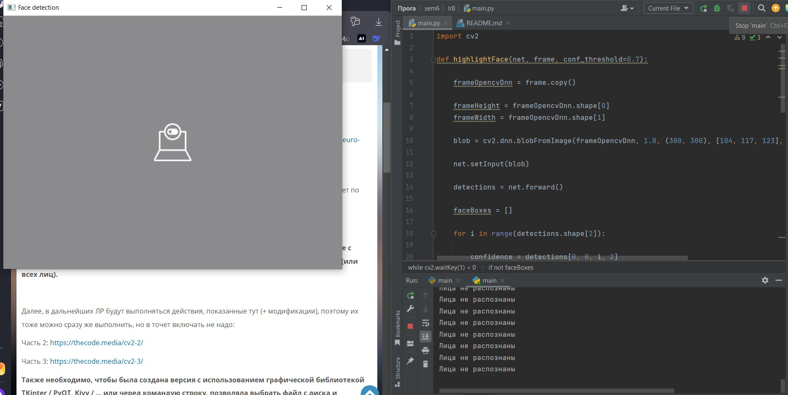
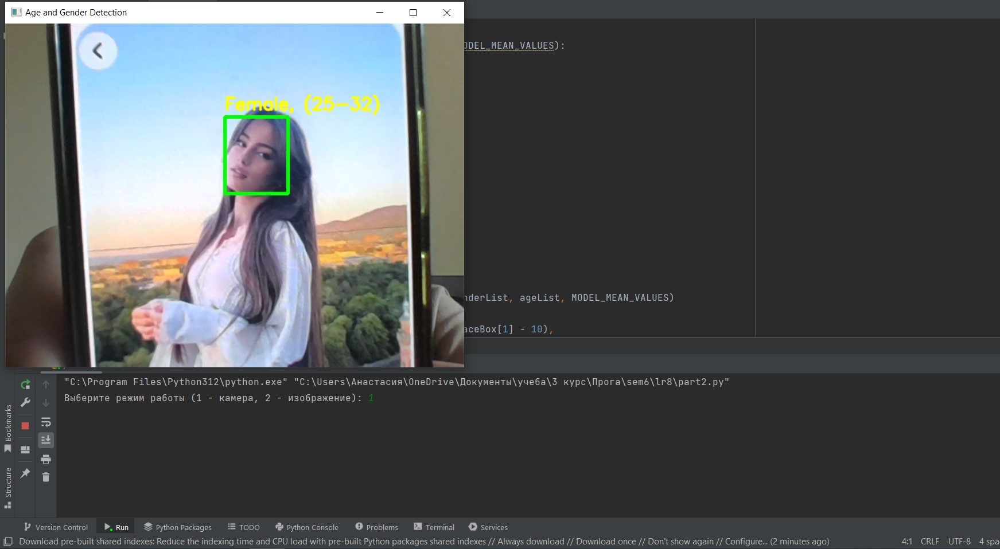
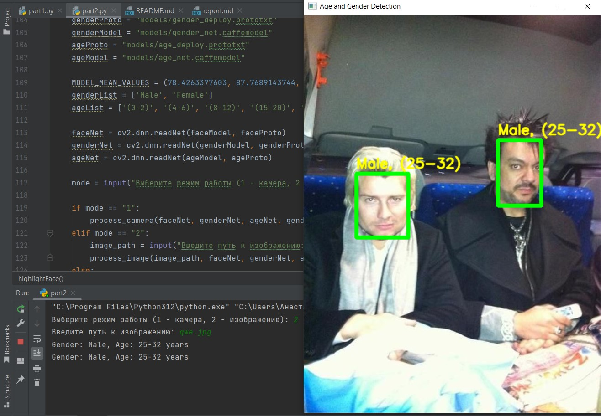

# Закаблукова Анастасия Эдуардовна ИВТ-1.1
## Лабораторная работа №8. Распознание лица.

Код на распознание лиц:
[код программы](part1.py)

Код на распознание лиц, возраста и пола:
[код программы](part2.py)

Результат работы программы (лицо не обнаржено):

Результат работы программы (распознание лица, возраста и пола с камеры):

Результат работы программы (распознание лица, возраста и пола с изображения):
