## Лабораторная работа №1

## Часть 1. Простое интегрирование

Написать код для численного интегрирования и оценить скорость выполнения интегрирования с помощью модуля timeit.

[код части 1](part1.py)

Результат:

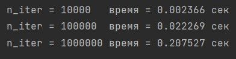

## Часть 2. Потоки

1.1 Написать программу, которая создает несколько потоков, а затем выводит их имена изнутри каждого потока.  
1.2 Написать программу для одновременной загрузки нескольких файлов с использованием потоков.  
1.3 Написать программу, которая выполняет одновременные HTTP-запросы с использованием потоков.  
1.4 Написать программу для вычисления факториала числа с использованием нескольких потоков.  
1.5 Написать программу для реализации многопоточного алгоритма быстрой сортировки.  

[код части 2](part2.py)

Результат для 1.1:

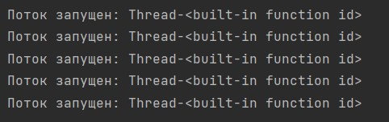

Результат для 1.2:

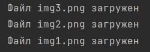

Результат для 1.3:

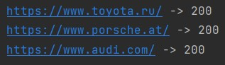

Результат для 1.4:

Результат для 1.5:

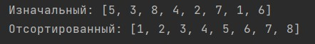

## Часть 3. Concurrency и Futures

2.1 Дополнить решений части 1 и провести замеры времени вычисления.

[код части 3 2.1](part3_2_1.py)

Результат:

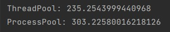

2.2 Написать программу, которая будет симулировать банк с использованием потоков и объектов Lock.

[код части 3 2.2](part3_2_2.py)

Результат:

2.3 Написать программу, чтобы асинхронно скачать несколько изображений с Интернета.

[код части 3 2.3](part3_2_3.py)

Результат:

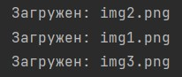

2.4 Создать два потока. Один - записывает данные в файл, второй - считывает данные из файла.

[код части 3 2.4](part3_2_4.py)

Результат:

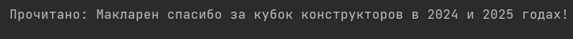

2.5 Написать программу, которая создает 3 потока: первый - устанавливает состояние объекта типа Event каждую секунду,
второй - ждет наступления события и выводит сообщение “Event occurred”,
третий - выводит сообщение “Event did not occur” до тех пор пока не наступит событие.

[код части 3 2.5](part3_2_5.py)

Результат:

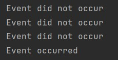

2.6 Создать программу, которая имеет свой класс "очередь", у котоорого есть методы 
добавления элементов в очередь и удаление элементов из очереди. Использовать рекурсивный
блокировщик RLock для безопасности доступа к очереди из потоков.

[код части 3 2.6](part3_2_6.py)

Результат:

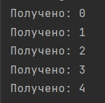

2.7 Создать два потока, предоставляющие сервер и клиент, где клиентский поток
будет ждать готовности сервера, прежде чес отправлять ему какой-либо запрос.

[код части 3 2.7](part3_2_7.py)

Результат:

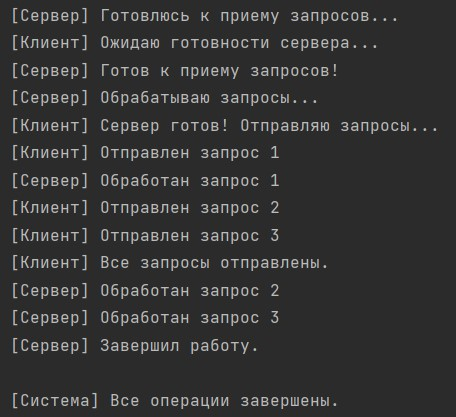

2.8 Напишите программу для параллельного поиска файла в директории. Каждый поток должен
обрабатывать свой фрагмент файлов директории и синхронизироваться с другими потоками,
чтобы убедиться, что файл найден только один раз. Как только первый файл по его шаблону найден,
все потоки поиска завершаются.

[код части 3 2.8](part3_2_8.py)

Результат:

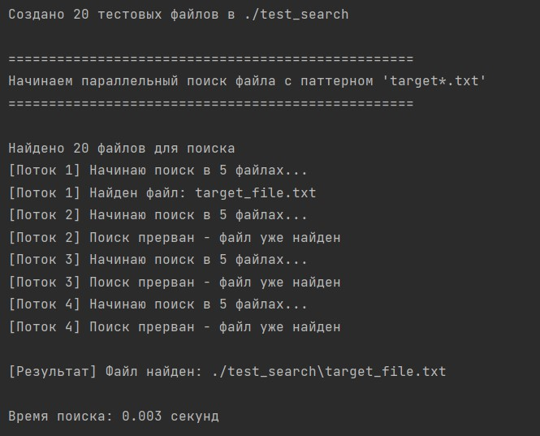

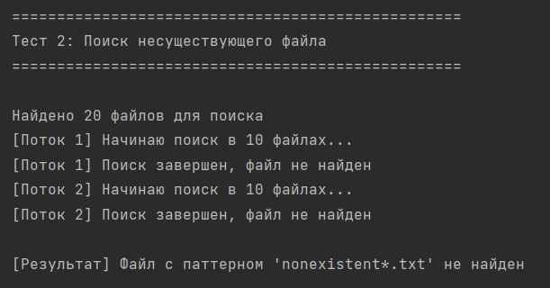

