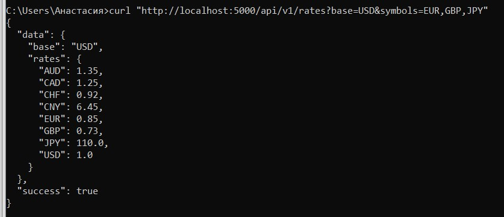
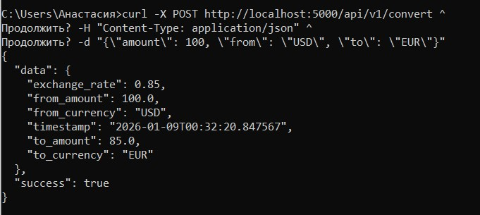

## Лабораторная работа №2

Вариант 2. Конвертер валют

1. Установка зависимостей

```
python app.py
```

2. Запуск сервера

```
pip install -r requirements.txt
```

3. Тестирование

Получение курсов валют

```
curl "http"//localhost:5000/api/v1/rates?base=USD&symbols=EUR,GBP,JPY" 
```

Результат:



Конвертация валюты

```
curl -X POST http://localhost:5000/api/v1/convert \
  -H "Content-Type: application/json" \
  -d '{"amount": 100, "from": "USD", "to": "EUR"}'
```

Результат:


