1. Установка Django
- Установка django
```
py -m pip install Django
```
- Проверка
```
django-admin --version
```
Результат:
```
5.2.6
```

2. Учебник часть 1
- Создание проекта
```
django-admin startproject mysite .
```
Получаем такую структуру:  
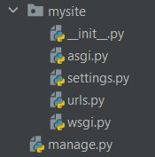

- Запускаем сервер
```
py manage.py runserver
```
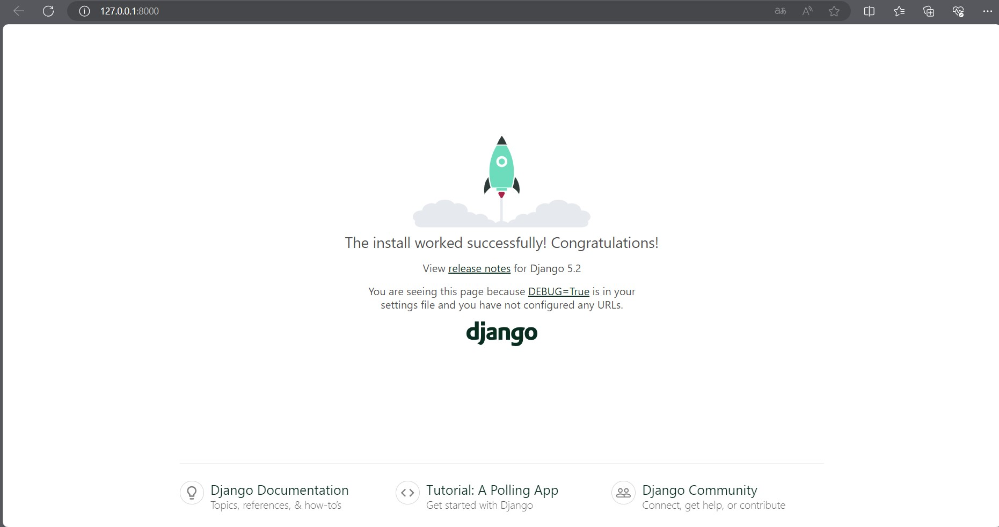

- Создание приложения для проведения опросов
```
py manage.py startapp polls
```
Получаем такую структуру:  
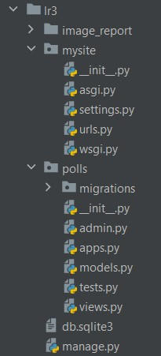

- Создание первого представления в [views.py](polls/views.py) в polls

```python
from django.http import HttpResponse

def index(request):
    return HttpResponse("Привет, мир. Ты на странице с результатами голосования.")
```

Сопоставление с URL-адресом:
- создать файл [urls.py](polls/urls.py) в polls
```python
from django.urls import path
from . import views

urlpatterns = [
    path('', views.index, name='index'),
]
```
- добавить импорт в [mysite/urls.py](mysite/urls.py)

Результат:  
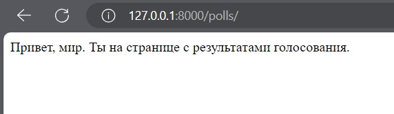

3. Учебник часть 2
- Изменить часовой пояс в [mysite/settings.py](mysite/settings.py)
- Создание таблицы в базе данных
```
py manage.py migrate
```
- Создание [моделей](polls/models.py)
- Активация моделей, добавив 'polls.apps.PollsConfig'
- Создание миграции модели
```
python manage.py makemigrations polls
```
SQL-код, который выполняет миграция:  
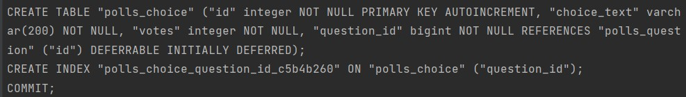
- Миграция для моделей
```
python manage.py migrate
```
- Запускаем интерактивную оболочку Django
```
python manage.py shell
```
- Создаем супер пользователя
```
python manage.py createsuperuser
```
Результат:  
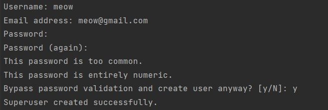
- Регистрируем модели в админ-панели, создав файл [polls/admin.py](polls/admin.py)

Результат:  
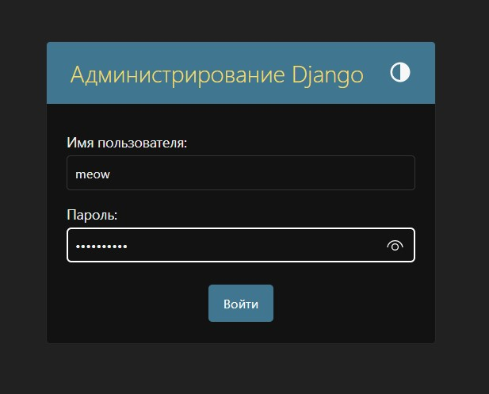

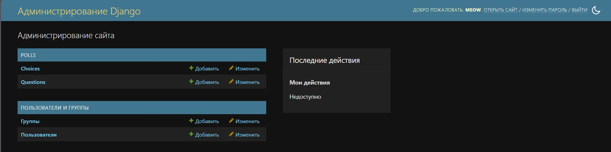

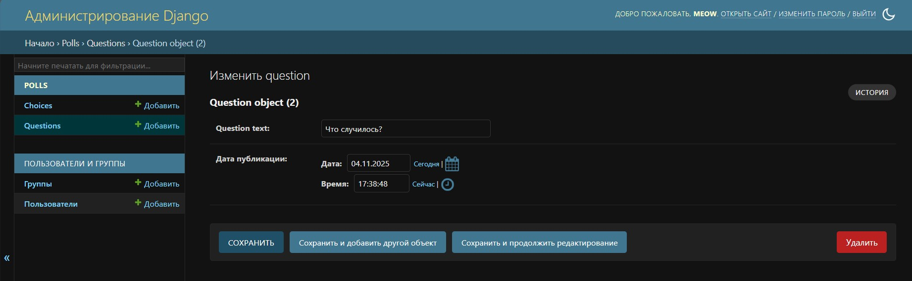

3. Учебник часть 3.
- Создание дополнительных представлений в [polls/views.py](polls/views.py)
- Создание URL-маршрутов в [polls/urls.py](polls/urls.py)
- Создание структуры папок для шаблонов

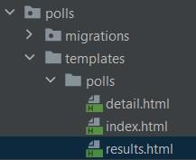

- Создание представления для голосования
```python
from django.http import HttpResponse, HttpResponseRedirect
from django.urls import reverse
from .models import Question, Choice

def vote(request, question_id):
    question = get_object_or_404(Question, pk=question_id)
    try:
        selected_choice = question.choice_set.get(pk=request.POST['choice'])
    except (KeyError, Choice.DoesNotExist):
        return render(request, 'polls/detail.html', {
            'question': question,
            'error_message': "You didn't select a choice.",
        })
    else:
        selected_choice.votes += 1
        selected_choice.save()
        return HttpResponseRedirect(reverse('polls:results', args=(question.id,)))
```
- Добавление URL для голосования
```python
from django.urls import path
from . import views

app_name = 'polls'
urlpatterns = [
    path('', views.index, name='index'),
    path('<int:question_id>/', views.detail, name='detail'),
    path('<int:question_id>/results/', views.results, name='results'),
    path('<int:question_id>/vote/', views.vote, name='vote'),
]
```

Результат:

Список опросов:  
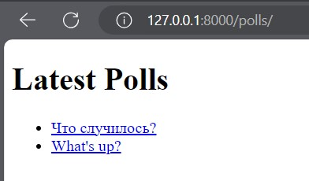

Детали опроса:  
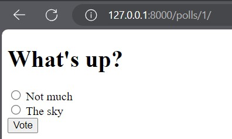

Результаты опроса:  
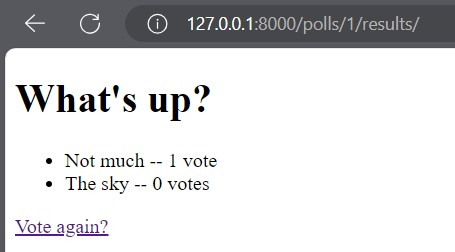

4. Учебник часть 4
- Улучшение представления голосования в [polls/views.py](polls/views.py)
```python
from django.views import generic
from django.urls import reverse
from .models import Question, Choice

class IndexView(generic.ListView):
    template_name = 'polls/index.html'
    context_object_name = 'latest_question_list'

    def get_queryset(self):
        """Return the last five published questions."""
        return Question.objects.order_by('-pub_date')[:5]

class DetailView(generic.DetailView):
    model = Question
    template_name = 'polls/detail.html'

class ResultsView(generic.DetailView):
    model = Question
    template_name = 'polls/results.html'

# Функция vote остается без изменений
def vote(request, question_id):
    question = get_object_or_404(Question, pk=question_id)
    try:
        selected_choice = question.choice_set.get(pk=request.POST['choice'])
    except (KeyError, Choice.DoesNotExist):
        return render(request, 'polls/detail.html', {
            'question': question,
            'error_message': "You didn't select a choice.",
        })
    else:
        selected_choice.votes += 1
        selected_choice.save()
        return HttpResponseRedirect(reverse('polls:results', args=(question.id,)))
```

- Обновление [polls/models.py](polls/models.py) с испровлением ошибки "показ вопросов с будущей датой публикации"
```python
import datetime
from django.db import models
from django.utils import timezone

class Question(models.Model):
    question_text = models.CharField(max_length=200)
    pub_date = models.DateTimeField('date published')
    
    def __str__(self):
        return self.question_text
    
    def was_published_recently(self):
        now = timezone.now()
        return now - datetime.timedelta(days=1) <= self.pub_date <= now

class Choice(models.Model):
    question = models.ForeignKey(Question, on_delete=models.CASCADE)
    choice_text = models.CharField(max_length=200)
    votes = models.IntegerField(default=0)
    
    def __str__(self):
        return self.choice_text
```

Пытаемся создать вопрос с датой публикацией из будущего:  
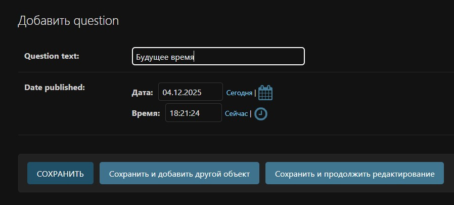

Проверка создался ли вопрос:  
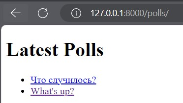

5. Учебник часть 5
- Создание [polls/tests.py](polls/tests.py)
```python
import datetime
from django.test import TestCase
from django.utils import timezone
from .models import Question

class QuestionModelTests(TestCase):
    def test_was_published_recently_with_future_question(self):
        """
        was_published_recently() returns False for questions whose pub_date
        is in the future.
        """
        time = timezone.now() + datetime.timedelta(days=30)
        future_question = Question(pub_date=time)
        self.assertIs(future_question.was_published_recently(), False)
```
- Запуск тестов
```
python manage.py test polls
```

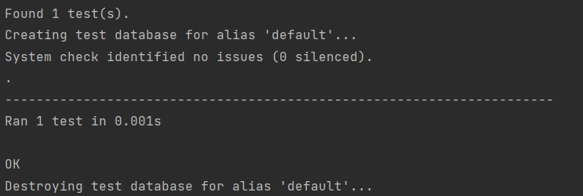

- Добавление еще тестов
```python
def test_was_published_recently_with_old_question(self):
    """
    was_published_recently() returns False for questions whose pub_date
    is older than 1 day.
    """
    time = timezone.now() - datetime.timedelta(days=1, seconds=1)
    old_question = Question(pub_date=time)
    self.assertIs(old_question.was_published_recently(), False)

def test_was_published_recently_with_recent_question(self):
    """
    was_published_recently() returns True for questions whose pub_date
    is within the last day.
    """
    time = timezone.now() - datetime.timedelta(hours=23, minutes=59, seconds=59)
    recent_question = Question(pub_date=time)
    self.assertIs(recent_question.was_published_recently(), True)
```

Результаты тестирования:  
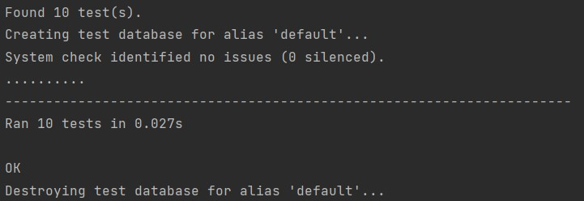

6. Учебник часть 6
- Добавление статических файлов
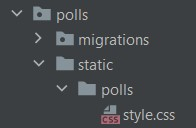
```
li a {
    color: green;
}
```
- Подключение CSS к шаблонам в [polls/templates/polls/index.html](polls/templates/polls/index.html)
```


<!DOCTYPE html>
<html>
<head>
    <title>Polls</title>
    <link rel="stylesheet" type="text/css" href="">
</head>
<body>
    <h1>Latest Polls</h1>
    
        <ul>
        
            <li>
                <a href="">
                    {{ question.question_text }}
                </a>
            </li>
        
        </ul>
    
        <p>No polls are available.</p>
    
</body>
</html>
```
- Кастомизация админ-панели
- Улучшение отображения модели Question в админке
```python
from django.contrib import admin
from .models import Question, Choice

class ChoiceInline(admin.StackedInline):
    model = Choice
    extra = 3

class QuestionAdmin(admin.ModelAdmin):
    fieldsets = [
        (None,               {'fields': ['question_text']}),
        ('Date information', {'fields': ['pub_date'], 'classes': ['collapse']}),
    ]
    inlines = [ChoiceInline]
    list_display = ('question_text', 'pub_date', 'was_published_recently')
    list_filter = ['pub_date']
    search_fields = ['question_text']

admin.site.register(Question, QuestionAdmin)
```
- Улучшение метода was_published_recently
```
class Question(models.Model):
    question_text = models.CharField(max_length=200)
    pub_date = models.DateTimeField('date published')
    
    def __str__(self):
        return self.question_text
    
    def was_published_recently(self):
        now = timezone.now()
        return now - datetime.timedelta(days=1) <= self.pub_date <= now
    
    was_published_recently.admin_order_field = 'pub_date'
    was_published_recently.boolean = True
    was_published_recently.short_description = 'Published recently?'
```

Ссылки на опросы поменяли цвет на зеленый:  
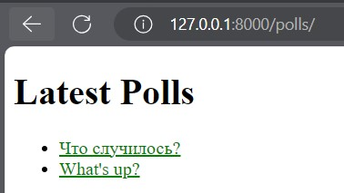

Кастомизированная админка:  
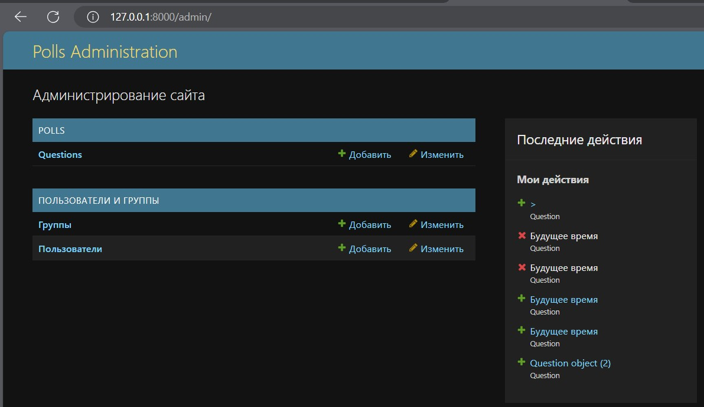

7. Учебник часть 7
- Улучшение формы создания вопроса
```python
from django.contrib import admin
from .models import Choice, Question

class ChoiceInline(admin.TabularInline):
    model = Choice
    extra = 3

class QuestionAdmin(admin.ModelAdmin):
    fieldsets = [
        (None,               {'fields': ['question_text']}),
        ('Date information', {'fields': ['pub_date'], 'classes': ['collapse']}),
    ]
    inlines = [ChoiceInline]
    list_display = ('question_text', 'pub_date', 'was_published_recently')
    list_filter = ['pub_date']
    search_fields = ['question_text']
    list_per_page = 25

admin.site.register(Question, QuestionAdmin)
```

Результат:  
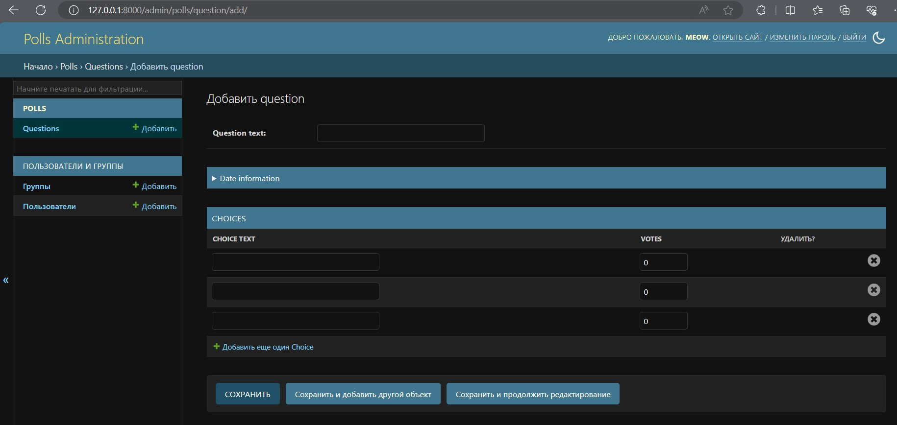