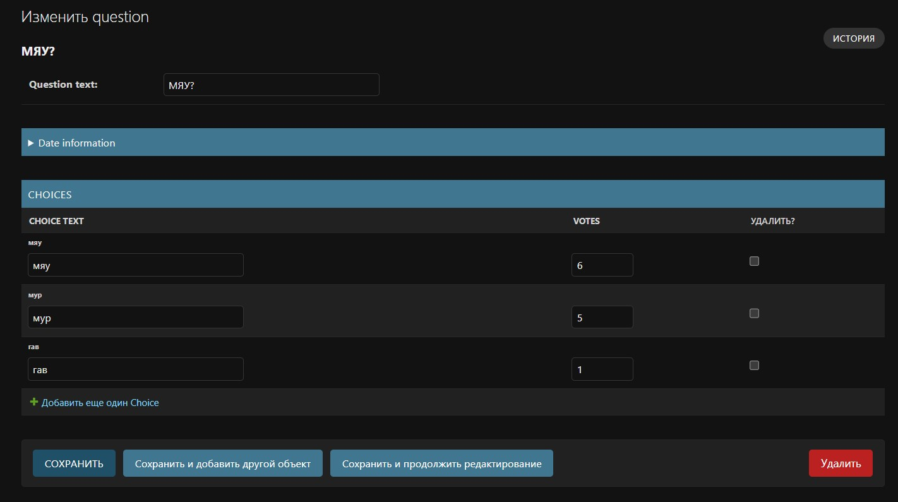

## Часть 1. Улучшение приложения для голосования.

- Обновление модели Question
```python
from django.db import models
from django.utils import timezone
import datetime

class Question(models.Model):
    question_text = models.CharField(max_length=200)
    pub_date = models.DateTimeField('date published')
    
    def __str__(self):
        return self.question_text
    
    def was_published_recently(self):
        now = timezone.now()
        return now - datetime.timedelta(days=1) <= self.pub_date <= now

class Choice(models.Model):
    question = models.ForeignKey(Question, on_delete=models.CASCADE)
    choice_text = models.CharField(max_length=200)
    votes = models.IntegerField(default=0)
    
    def __str__(self):
        return self.choice_text
```
- Создание формы для добавления опросов
```python
from django import forms
from .models import Question, Choice

class QuestionForm(forms.Form):
    question_text = forms.CharField(
        label='Question Text',
        max_length=200,
        widget=forms.TextInput(attrs={'class': 'form-control', 'placeholder': 'Enter your question here'})
    )
    choices = forms.CharField(
        label='Choices (one per line)',
        widget=forms.Textarea(attrs={
            'class': 'form-control', 
            'placeholder': 'Enter each choice on a separate line',
            'rows': 5
        }),
        help_text='Enter each choice on a separate line'
    )
```
- Обновление представления
```python
from django.shortcuts import render, get_object_or_404, redirect
from django.http import HttpResponseRedirect
from django.urls import reverse
from django.utils import timezone
from django.contrib import messages

from .models import Question, Choice
from .forms import QuestionForm

def index(request):
    latest_question_list = Question.objects.filter(
        pub_date__lte=timezone.now()
    ).order_by('-pub_date')[:5]
    context = {'latest_question_list': latest_question_list}
    return render(request, 'polls/index.html', context)

def detail(request, question_id):
    question = get_object_or_404(Question, pk=question_id)
    return render(request, 'polls/detail.html', {'question': question})

def results(request, question_id):
    question = get_object_or_404(Question, pk=question_id)
    return render(request, 'polls/results.html', {'question': question})

def vote(request, question_id):
    question = get_object_or_404(Question, pk=question_id)
    try:
        selected_choice = question.choice_set.get(pk=request.POST['choice'])
    except (KeyError, Choice.DoesNotExist):
        return render(request, 'polls/detail.html', {
            'question': question,
            'error_message': "You didn't select a choice.",
        })
    else:
        selected_choice.votes += 1
        selected_choice.save()
        return HttpResponseRedirect(reverse('polls:results', args=(question.id,)))

def create_question(request):
    if request.method == 'POST':
        form = QuestionForm(request.POST)
        if form.is_valid():
            # Create the question
            question = Question(
                question_text=form.cleaned_data['question_text'],
                pub_date=timezone.now()
            )
            question.save()
            
            # Create choices from the textarea
            choices_text = form.cleaned_data['choices']
            choices_list = [choice.strip() for choice in choices_text.split('\n') if choice.strip()]
            
            for choice_text in choices_list:
                choice = Choice(
                    question=question,
                    choice_text=choice_text,
                    votes=0
                )
                choice.save()
            
            messages.success(request, 'Question created successfully!')
            return redirect('polls:index')
    else:
        form = QuestionForm()
    
    return render(request, 'polls/create_question.html', {'form': form})
```
- Создание шаблона для формы создания опроса
```html
<!DOCTYPE html>
<html>
<head>
    <title>Create New Poll</title>
    <link href="https://cdn.jsdelivr.net/npm/bootstrap@5.1.3/dist/css/bootstrap.min.css" rel="stylesheet">
</head>
<body>
    <div class="container mt-5">
        <div class="row justify-content-center">
            <div class="col-md-8">
                <div class="card">
                    <div class="card-header">
                        <h2 class="text-center">Create New Poll</h2>
                    </div>
                    <div class="card-body">
                        
                            
                                <div class="alert alert-{{ message.tags }} alert-dismissible fade show" role="alert">
                                    {{ message }}
                                    <button type="button" class="btn-close" data-bs-dismiss="alert"></button>
                                </div>
                            
                        
                        
                        <form method="post">
                            
                            
                            <div class="mb-3">
                                <label for="{{ form.question_text.id_for_label }}" class="form-label">
                                    {{ form.question_text.label }}
                                </label>
                                {{ form.question_text }}
                                
                                    <div class="form-text">{{ form.question_text.help_text }}</div>
                                
                                
                                    <div class="text-danger">
                                        {{ form.question_text.errors }}
                                    </div>
                                
                            </div>
                            
                            <div class="mb-3">
                                <label for="{{ form.choices.id_for_label }}" class="form-label">
                                    {{ form.choices.label }}
                                </label>
                                {{ form.choices }}
                                
                                    <div class="form-text">{{ form.choices.help_text }}</div>
                                
                                
                                    <div class="text-danger">
                                        {{ form.choices.errors }}
                                    </div>
                                
                            </div>
                            
                            <div class="d-grid gap-2 d-md-flex justify-content-md-end">
                                <a href="" class="btn btn-secondary me-md-2">Cancel</a>
                                <button type="submit" class="btn btn-primary">Create Poll</button>
                            </div>
                        </form>
                    </div>
                </div>
            </div>
        </div>
    </div>
    
    <script src="https://cdn.jsdelivr.net/npm/bootstrap@5.1.3/dist/js/bootstrap.bundle.min.js"></script>
</body>
</html>
```
- Обновление главной страницы
```html
<!DOCTYPE html>
<html>
<head>
    <title>Polls App</title>
    <link href="https://cdn.jsdelivr.net/npm/bootstrap@5.1.3/dist/css/bootstrap.min.css" rel="stylesheet">
</head>
<body>
    <div class="container mt-4">
        <div class="d-flex justify-content-between align-items-center mb-4">
            <h1>Polls</h1>
            <a href="" class="btn btn-success">Create New Poll</a>
        </div>
        
        
            <div class="list-group">
                
                    <a href="" class="list-group-item list-group-item-action">
                        <div class="d-flex w-100 justify-content-between">
                            <h5 class="mb-1">{{ question.question_text }}</h5>
                            <small>{{ question.pub_date|date:"M d, Y" }}</small>
                        </div>
                        <p class="mb-1">Click to vote</p>
                    </a>
                
            </div>
        
            <div class="alert alert-info">
                <p>No polls are available.</p>
                <a href="" class="btn btn-primary">Create the first poll!</a>
            </div>
        
    </div>
</body>
</html>
```
- Обновление URLs
```python
from django.urls import path
from . import views

app_name = 'polls'
urlpatterns = [
    path('', views.index, name='index'),
    path('<int:question_id>/', views.detail, name='detail'),
    path('<int:question_id>/results/', views.results, name='results'),
    path('<int:question_id>/vote/', views.vote, name='vote'),
    path('create/', views.create_question, name='create_question'),
]
```
- Добавление валидации в форму
```python
from django import forms
from django.core.exceptions import ValidationError
from .models import Question, Choice

class QuestionForm(forms.Form):
    question_text = forms.CharField(
        label='Question Text',
        max_length=200,
        widget=forms.TextInput(attrs={'class': 'form-control', 'placeholder': 'Enter your question here'})
    )
    choices = forms.CharField(
        label='Choices (one per line)',
        widget=forms.Textarea(attrs={
            'class': 'form-control', 
            'placeholder': 'Enter each choice on a separate line',
            'rows': 5
        }),
        help_text='Enter each choice on a separate line'
    )
    
    def clean_choices(self):
        choices_text = self.cleaned_data['choices']
        choices_list = [choice.strip() for choice in choices_text.split('\n') if choice.strip()]
        
        if len(choices_list) < 2:
            raise ValidationError('Please provide at least 2 choices.')
        
        if len(choices_list) > 10:
            raise ValidationError('Please provide no more than 10 choices.')
        
        if len(choices_list) != len(set(choices_list)):
            raise ValidationError('Please remove duplicate choices.')
        
        return choices_text
```
- Применение миграции
```
python manage.py makemigrations polls
python manage.py migrate
```

Результат:  


## Часть 2. Реализация аутентификации и регистрации пользователей на сайте.

- Настройка проекта
```python
INSTALLED_APPS = [
    'django.contrib.admin',
    'django.contrib.auth',
    'django.contrib.contenttypes',
    'django.contrib.sessions',
    'django.contrib.messages',
    'django.contrib.staticfiles',
    'polls',
]

LOGIN_REDIRECT_URL = '/polls/'
LOGOUT_REDIRECT_URL = '/accounts/login/'
LOGIN_URL = '/accounts/login/'
```
- Создание формы аутификации  
[polls/forms.py](polls/forms.py)
- Обновление представления
[polls/views.py](polls/views.py)
- Создание шаблона регистрации
[polls/templates/polls/register.html](polls/templates/polls/register.html)
- Создание шаблона входа
[polls/templates/polls/login.html](polls/templates/polls/login.html)
- Создание шаблона профиля
[polls/templates/polls/profile.html](polls/templates/polls/profile.html)
- Создание навигационной панели
[polls/templates/polls/navbar.html](polls/templates/polls/navbar.html)
- Обновление главного шаблона
[polls/templates/polls/index.html](polls/templates/polls/index.html)  

[polls/templates/polls/create_question.html](polls/templates/polls/create_question.html)
- Обновление URLs
[polls/urls.py](polls/urls.py)
- Применение миграции
```
python manage.py makemigrations polls
python manage.py migrate
```