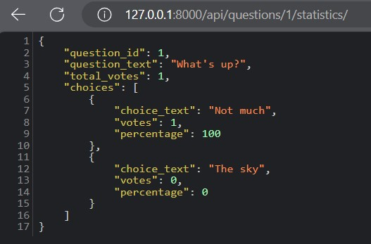
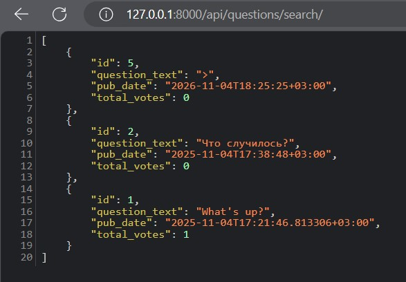
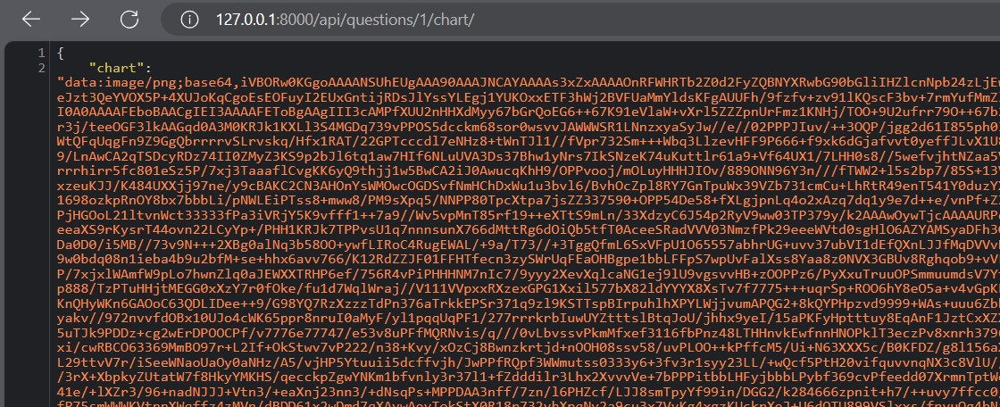
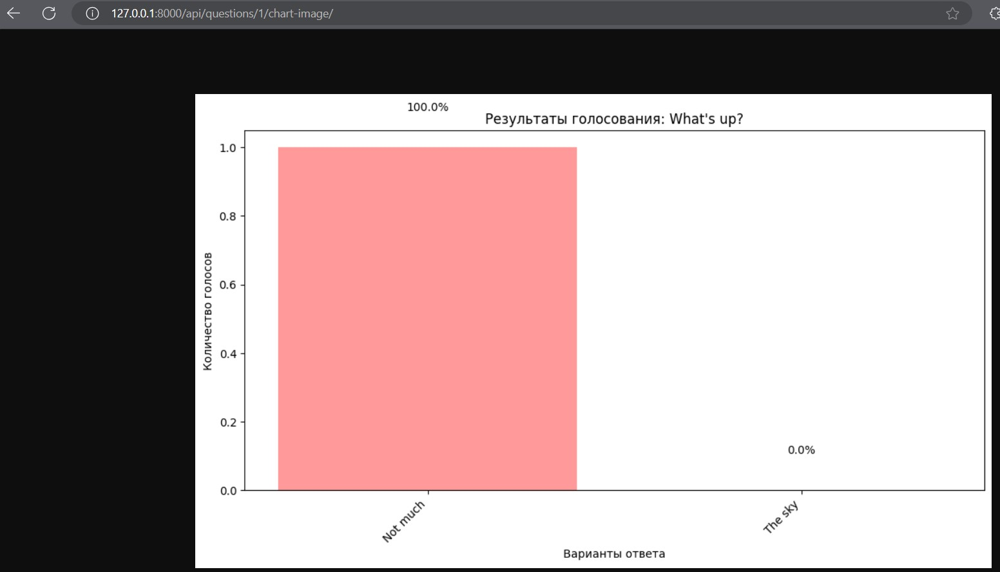
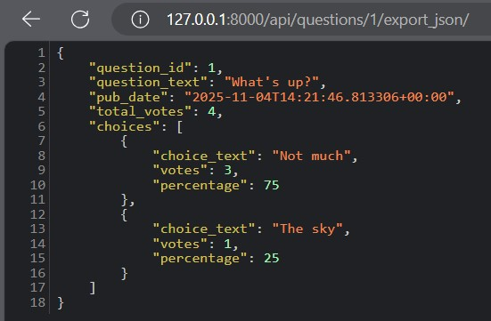
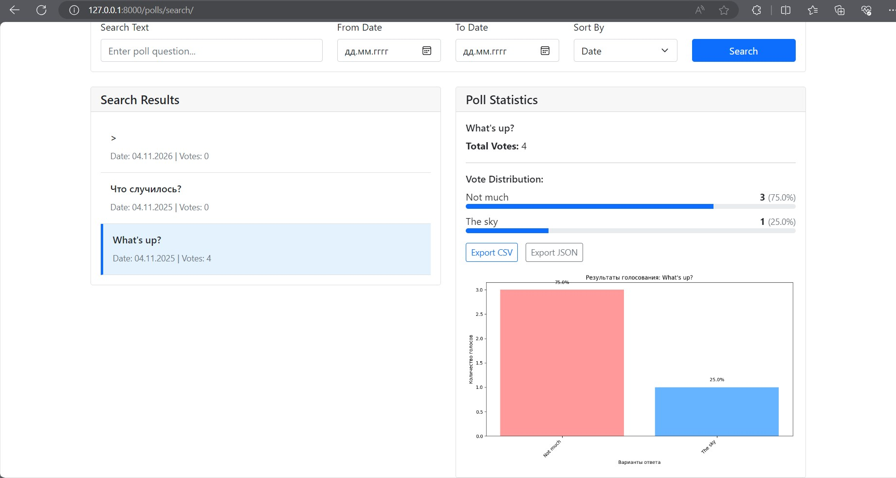

## Django REST Framework: микросервисы

1. Статистика по голосованиям
- общее количество гоосований
- количество голосов за каждый вариант ответа
- процентное соотношение голосов



2. Сортировака и фильтрация данных
- по дате проведения
- по популярности
- по тексту вопроса



3. Графики и диаграммы
- столбчатые диаграммы с результатами голосований
- отображение процентов на диаграммах
- возврат в формате base64 PNG





4. Экспорт данных
- CSV формат
- JSON формат



Результат:



* Установка необходимых пакетов.
```
pip install djangorestframework
pip install django-cors-headers
pip install matplotlib
```

* Настройка проекта.

[mysite/settings.py](mysite/settings.py)

Дополнить:
```
INSTALLED_APPS = [
    'rest_framework',
    'corsheaders',
]

MIDDLEWARE = [
    'corsheaders.middleware.CorsMiddleware',
]

REST_FRAMEWORK = {
    'DEFAULT_PERMISSION_CLASSES': [
        'rest_framework.permissions.AllowAny',
    ],
    'DEFAULT_RENDERER_CLASSES': [
        'rest_framework.renderers.JSONRenderer',
    ]
}

CORS_ALLOW_ALL_ORIGINS = True
CORS_ALLOWED_ORIGINS = [
    "http://localhost:8000",
    "http://127.0.0.1:8000",
]
```

* Создание сериализаторов.  
[polls/serializers.py](polls/serializers.py)

* Обновление моделей.  

[polls/models.py](polls/models.py)

Дополнить:
```python
class Question(models.Model):
    # --- код ---

    def total_votes(self):
        return sum(choice.votes for choice in self.choice_set.all())

class Choice(models.Model):
    # --- код ---

    def percentage(self):
        total = self.question.total_votes()
        if total == 0:
            return 0
        return (self.votes / total) * 100
```

* Создание представлений API.  
[polls/api_views.py](polls/api_views.py)

* Настройка URLs API.  
[polls/urls_api.py](polls/urls_api.py)

* Обновление основных URLs.

[mysite/urls.py](mysite/urls.py)

Дополнить:
```python
urlpatterns = [
    path('', include('polls.urls_api')),
]
```

* Cоздание страницы поиска голосований.

[polls/templates/polls/search.html](polls/templates/polls/search.html)

* Обновление URLs.

[polls/urls.py](polls/urls.py)

Дополнить:
```python
urlpatterns = [
    path('search/', views.search_polls, name='search_polls'),
]
```

* Добавление представления для страницы поиска.

[polls/views.py](polls/views.py)

```python
def search_polls(request):
    """Страница поиска и анализа голосований"""
    return render(request, 'polls/search.html')
```

* Обновление навигационной панели.

[polls/templates/polls/navbar.html](polls/templates/polls/navbar.html)

* Применение миграций.

```
python manage.py makemigrations
python manage.py migrate
```