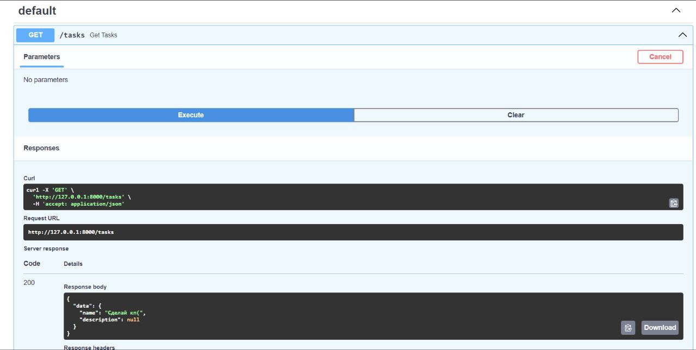
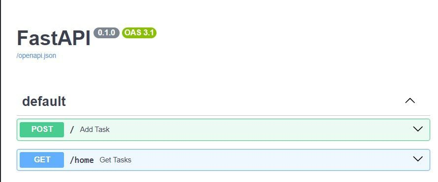
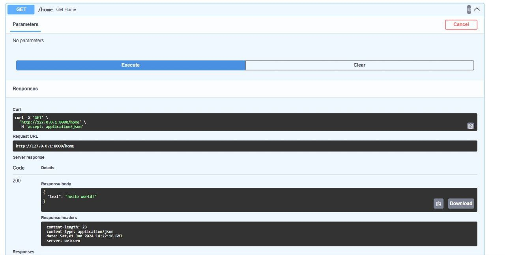

# Лабораторная работа № 11. Локальное развертывание проекта на FAST.API
---
1. Создание окружения.
```python
py -m venv venv
```
   Активация окружения.
```python
.\venv\Scripts\activate
```   
2. Запускаем небольшое приложение.
Код:
```python
from fastapi import FastAPI
app = FastAPI()
@app.get("/home")
def get_home():
    return {"data": "Hello world!"}
```   
```
python -m uvicorn main:app --reload
```  

Результат:  


3. Дополняем приложение.
   
```python
from fastapi import FastAPI
from pydantic import BaseModel
from typing import Optional

app = FastAPI()

class Task(BaseModel):
    name: str
    description: Optional[str] = None

@app.get("/tasks")
def get_tasks():
    task = Task(name= "Do KP(")
    return {"data" : task}
```
Проверяем работоспособность по маршруту http:/"сервер"/docs.



4. Итоговое приложение.
   
```python
from fastapi import FastAPI, Depends
from pydantic import BaseModel
from typing import Optional, Annotated

app = FastAPI()

class STaskAdd(BaseModel):
    name: str
    description: Optional[str] = None

class STask(STaskAdd):
    id: int

@app.post("/")
async def add_task(task: Annotated[STaskAdd, Depends()]):
    return {"data": task}

@app.get("/home")
def get_home():
    return {"text" : "hello world"}
```
Результат:  


Запрос POST:  


Запрос GET:  
