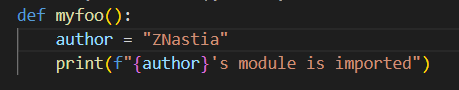
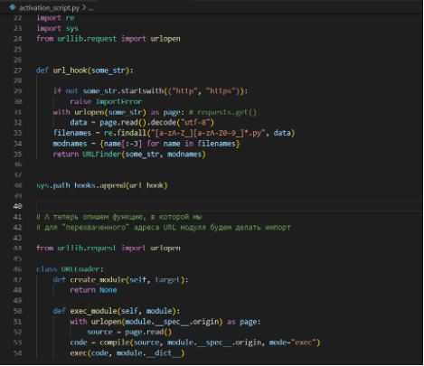
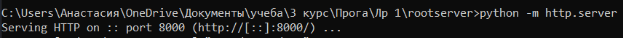
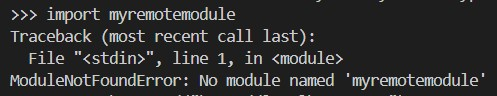
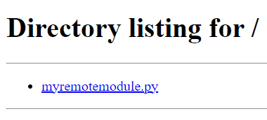
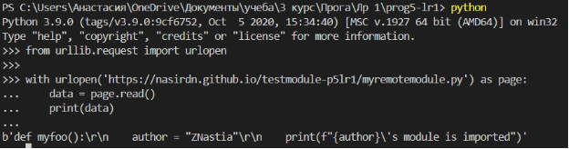

# Закаблукова Анастасия Эдуардовна ИВТ-1.1
## Лабораторная работа №1. Реализация удаленного импорта.

Первый шаг.  
Создать файл *myremotemodule.py*, который будет импортироваться и разместить его в каталоге *rootserver*.  

Второй шаг.  
Разместить в этом файле код.  

Третий шаг.  
Создать файл *activation_script.py*, который будет содержать функцию url_hook и классы URLLoader и URLFinder.  

Четвертый шаг.  
Запускаем сервер.  

Пятый шаг.  
Запускаем файл *activation_script.py*.  

Импортируем модуль.  

Шестой шаг.  
Добавляем путь, где располагается модуль в *sys.path*.  
  

Седьмой шаг.  
Импортируем файл *myremotemodule.py*, в котором размещена функция *myfoo*.  

Восьмой шаг.  
Используя в качестве источника модуля github pages.  
  
  

Девятый шаг.  
 
