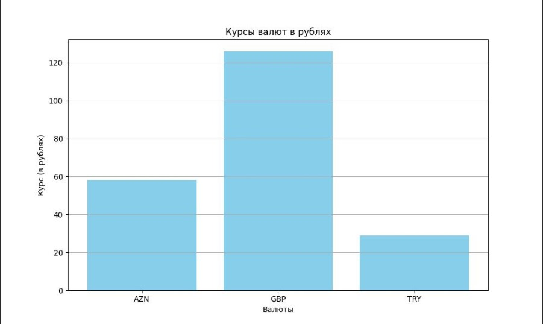

# Закаблукова Анастасия Эдуардовна ИВТ-1.1
## Лабораторная работа №5. Работа с валютами. Шаблон «одиночка».

Получить значения курсов валют с сайта ЦБ РФ в объектно-ориентированном стиле.
Реализовать шаблон проектирования "одиночка", чтобы нельзя было создавать больше, чем один объект данного класса.

Код:
[код программы](main.py)

Пример работы запуска класса:  
```python
currency_rates = CurrencyRates()
    result = currency_rates.get_rates(["R01035", "R01020A", "R01700J"])
```

Возвращается список валют с указанием курса и номинала:
```python
[{'AZN': ('Азербайджанский манат', ('58', '7900'), 1)}, 
 {'GBP': ('Фунт стерлингов Соединенного королевства', ('126', '2180'), 1)}, 
 {'TRY': ('Турецких лир', ('29', '0835'), 10)}]
```

Также реализован метод, который визуализирует полученные данные в виде графика и сохраняется в файле 'currencies.jpg'.  
