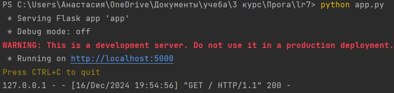
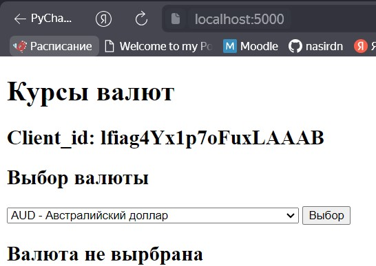
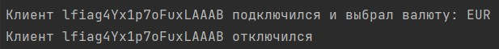

# Закаблукова Анастасия Эдуардовна ИВТ-1.1
## Лабораторная работа №7. Использование шаблона «Наблюдатель»

Необходимо создать программу на языке Python, которая использует паттерн проектирования "Наблюдатель" 
для отслеживания изменений курсов валют через API Центробанка РФ. Программа должна запрашивать курсы 
валют и уведомлять зарегистрированных наблюдателей о изменении курсов в реальном времени или через 
заданные интервалы времени.
Структура реализованного задания должна представлять:
- Объект — веб-сервер Flask или FastAPI, Tornado.
- Наблюдатели - клиенты, представляющие HTML-страницы, связывающиеся с объектом с помощью веб-сокетов. 
На странице должен отображаться идентификатор клиента.

[код приложения](app.py)

[код интерфейса](templates/index.html)

Запуск сервера:  

Результат при запуске:  

Результат при выборе валюты:  

Подключение и отключение клиента:  

## Тесты
* Тест для проверки подключения через WebSocket.

