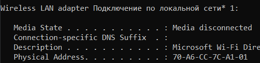
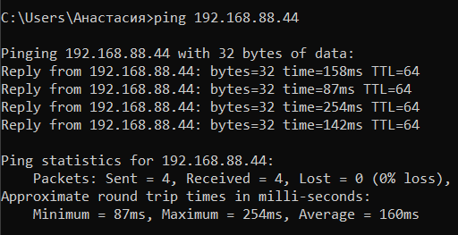
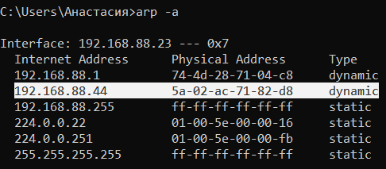

## Лабораторная работа №2. Определение MAC и работа с APR.
## Закаблукова Анастасия, ИВТ-1.1

Поиск MAC-фдреса через ipconfig /all.  

Запрос к узлу 192.168.88.44  

Физический адрес ущла, к которому был сделан запрос.  
