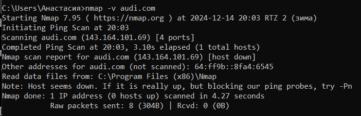

## Лабораторная работа №3. Исследование транспортного уровня.
## Закаблукова Анастасия, ИВТ-1.1

Исследование открытых соединений на компьютере с помощью утилиты Netstat.   

Просканировать порты хоста (официальный сайт Audi) помощью утилиты nmap.    

Просканировать порты хоста (сайт f1report – новости Формулы 1) помощью утилиты nmap.    

| Порт | Сервис     |
|------|------------|
| 21   | ftp        |
| 25   | smtp       |
| 53   | domain     |
| 80   | http       |
| 110  | pop3       |
| 143  | imap       |
| 443  | https      |
| 465  | smtps      |
| 587  | submission |
| 993  | imaps      |
| 995  | pop3s      |
| 2500 | rtsserv    |
| 5555 | freeciv    |