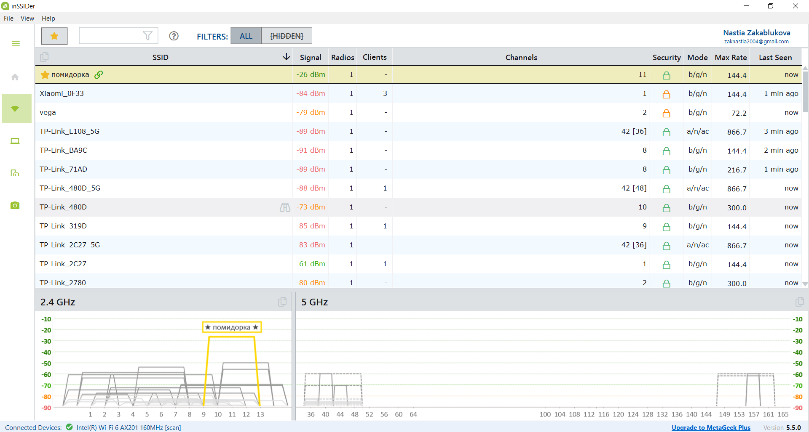

## Лабораторная работа №1. Анализ Wi-Fi окружения
## Закаблукова Анастасия, ИВТ-1.1

Стратегия по улучшению качества Wi-Fi:
- можно сменить диапазон, перейдя с 2,4 ГГц на 5 ГГц. Переместить роутер или объединить несколько в единую сеть.