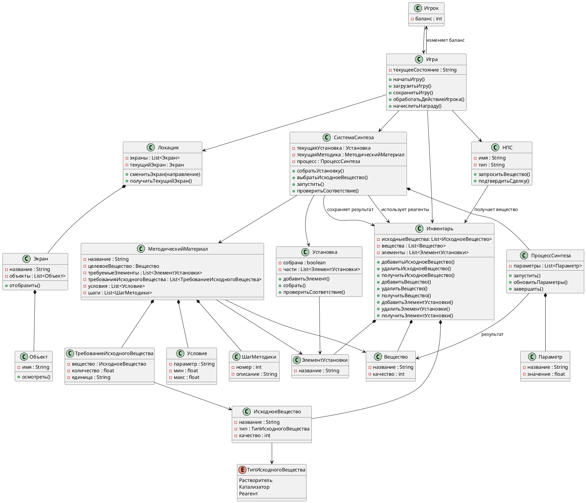

## Код для диаграммы классов

```puml
@startuml

class Игрок {
-баланс : int
}

class Игра {
-текущееСостояние : String 
+начатьИгру()
+загрузитьИгру()
+сохранитьИгру()
+обработатьДействиеИгрока()
+начислитьНаграду()
}

class Локация {
-экраны : List<Экран>
-текущийЭкран : Экран
+сменитьЭкран(направление)
+получитьТекущийЭкран()
}

class Экран {
-название : String
-объекты : List<Объект>
+отобразить()
}

class Объект {
-имя : String
+осмотреть()
}

class ЭлементУстановки {
-название : String
}

class ТребованиеИсходногоВещества {
-вещество : ИсходноеВещество
-количество : float
-единица : String
}

class Условие {
-параметр : String
-мин : float
-макс : float
}

class ШагМетодики {
-номер : int
-описание : String
}

class МетодическийМатериал {
-название : String 
-целевоеВещество : Вещество
-требуемыеЭлементы : List<ЭлементУстановки>
-требованияИсходногоВещества : List<ТребованиеИсходногоВещества>
-условия : List<Условие>
-шаги : List<ШагМетодики>
}

class СистемаСинтеза {
-текущаяУстановка : Установка
-текущаяМетодика : МетодическийМатериал
-процесс : ПроцессСинтеза
+собратьУстановку()
+выбратьИсходноеВещество()
+запустить()
+проверитьСоответствие()
}

class Установка {
-собрана : boolean
-части : List<ЭлементУстановки>
+добавитьЭлемент()
+собрать()
+проверитьСоответствие()
}

class ПроцессСинтеза {
-параметры : List<Параметр>
+запустить()
+обновитьПараметры()
+завершить()
}

class Параметр {
-название : String
-значение : float
}

enum ТипИсходногоВещества{
    Растворитель
    Катализатор
    Реагент
}

class ИсходноеВещество{
-название : String
-тип : ТипИсходногоВещества
-качество : int
}

class Вещество {
-название : String
-качество : int
}

class Инвентарь {
-исходныеВещества: List<ИсходноеВещество>
-вещества : List<Вещество>
-элементы : List<ЭлементУстановки>
+добавитьИсходноеВещество()
+удалитьИсходноеВещество()
+получитьИсходноеВещество()
+добавитьВещество()
+удалитьВещество()
+получитьВещество()
+добавитьЭлементУстановки()
+удалитьЭлементУстановки()
+получитьЭлементУстановки()
}

class НПС {
-имя : String
-тип : String
+запроситьВещество()
+подтвердитьСделку()
}

' --- Связи ---

Игрок --> Игра

Игра --> Локация
Игра --> СистемаСинтеза
Игра --> Инвентарь
Игра --> НПС

Локация *-- Экран
Экран *-- Объект

СистемаСинтеза --> Установка
СистемаСинтеза --> МетодическийМатериал 
СистемаСинтеза *-- ПроцессСинтеза

ПроцессСинтеза *-- Параметр

ПроцессСинтеза --> Вещество : результат

СистемаСинтеза --> Инвентарь : использует реагенты
СистемаСинтеза --> Инвентарь : сохраняет результат

Установка --> ЭлементУстановки

МетодическийМатериал *-- ТребованиеИсходногоВещества
МетодическийМатериал *-- Условие
МетодическийМатериал *-- ШагМетодики
МетодическийМатериал --> ЭлементУстановки
МетодическийМатериал --> Вещество

ТребованиеИсходногоВещества --> ИсходноеВещество

ИсходноеВещество --> ТипИсходногоВещества

Инвентарь *-- ИсходноеВещество
Инвентарь *-- Вещество
Инвентарь *-- ЭлементУстановки

НПС --> Инвентарь : получает вещество
Игра --> Игрок : изменяет баланс

@enduml
```