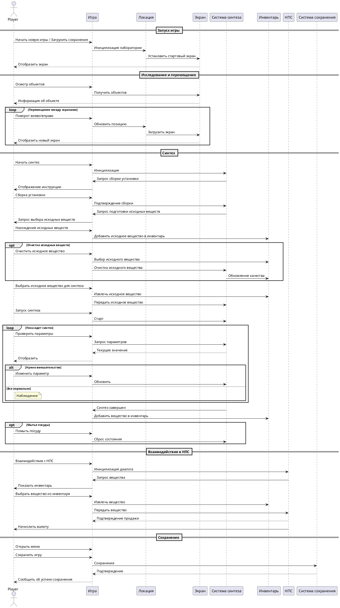

## Код для диаграммы последовательности

```puml
@startuml 

actor Player 

participant "Игра" as Game 
participant "Локация" as Location
participant "Экран" as Screen
participant "Система синтеза" as SynthSystem
participant "Инвентарь" as Inventory 
participant "НПС" as NPC 
participant "Система сохранения" as SaveSystem 

== Запуск игры ==
Player -> Game : Начать новую игры / Загрузить сохранение
Game -> Location : Иницилизация лаборатории
Location -> Screen : Установить стартовый экран
Screen --> Player : Отобразить экран

== Исследование и перемещение ==
Player -> Game : Осмотр объектов
Game -> Screen : Получить объектов
Screen --> Player : Информация об объекте

loop Перемещение между экранами
    Player -> Game : Поворот влево/вправо
    Game -> Location : Обновить позицию
    Location -> Screen : Загрузить экран
    Screen --> Player : Отобразить новый экран
end

== Синтез ==
Player -> Game : Начать синтез
Game -> SynthSystem : Иницилизация

SynthSystem -> Game : Запрос сборки установки
Game -> Player : Отображение инструкции
Player -> Game : Сборка установки
Game -> SynthSystem : Подтверждение сборки

SynthSystem -> Game : Запрос подготовки исходных веществ
Game -> Player : Запрос выбора исходных веществ
Player -> Game : Нахождение исходных веществ
Game -> Inventory : Добавить исходное вещество в инвентарь

opt Очистка исходных веществ
    Player -> Game : Очистить исходное вещество
    Game -> Inventory : Выбор исходного вещества
    Game -> SynthSystem : Очистка исходного вещества
    SynthSystem -> Inventory : Обновление качества
end

Player -> Game : Выбрать исходное вещество для синтеза
Game -> Inventory : Извлечь исходное вещество
Game -> SynthSystem  : Передать исходное вещество

Player -> Game : Запуск синтеза
Game -> SynthSystem : Старт

loop Пока идет синтез
    Player -> Game : Проверить параметры
    Game -> SynthSystem : Запрос параметров
    SynthSystem --> Game : Текущее значение
    Game --> Player : Отобразить
    
    alt Нужно вмешательство
        Player -> Game : Изменить параметр
        Game -> SynthSystem : Обновить
    else Все нормально
        note right of Player : Наблюдение
    end
end

SynthSystem -> Game : Синтез завершен
Game -> Inventory : Добавить вещество в инвентарь

opt Мытье посуды
    Player -> Game : Помыть посуду
    Game -> SynthSystem : Сброс состояния
end

== Взаимодействие в НПС ==
Player -> Game : Взаимодействие с НПС
Game -> NPC : Иницилизация диалога
NPC -> Game : Запрос вещества
Game -> Player : Показать инвентарь

Player -> Game : Выбрать вещество из инвентаря
Game -> Inventory : Извлечь вещество
Game -> NPC : Передать вещество

NPC --> Game : Подтверждение продажи
NPC -> Player : Начислить валюту

== Сохранение ==
Player -> Game : Открыть меню
Player -> Game : Сохранить игру
Game -> SaveSystem : Сохранение 
SaveSystem --> Game : Подтверждение 
Game --> Player : Сообщить об успехе сохранения 

@enduml
```