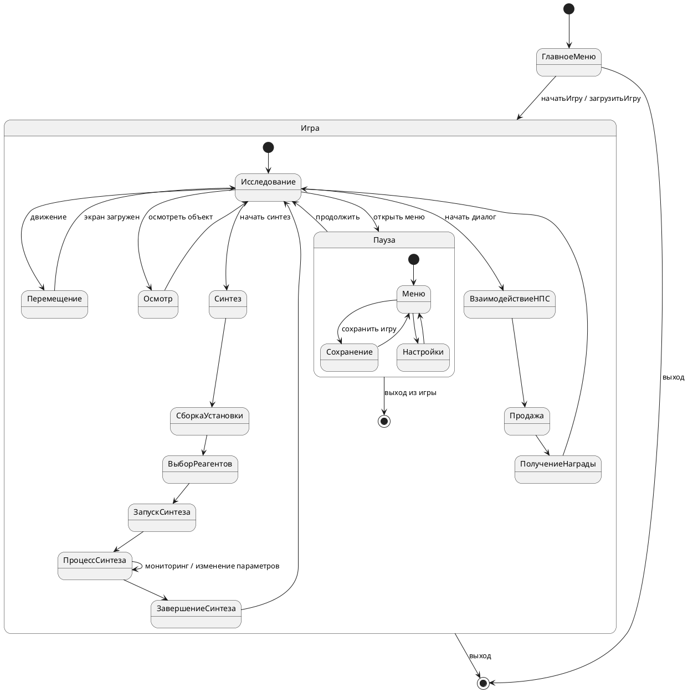

## Код для диаграммы состояния

```puml
@startuml

[*] --> ГлавноеМеню

ГлавноеМеню --> Игра : начатьИгру / загрузитьИгру
ГлавноеМеню --> [*] : выход

state Игра {

    [*] --> Исследование

    Исследование --> Перемещение : движение
    Перемещение --> Исследование : экран загружен

    Исследование --> Осмотр : осмотреть объект
    Осмотр --> Исследование

    Исследование --> Синтез : начать синтез
    Синтез --> СборкаУстановки
    СборкаУстановки --> ВыборРеагентов
    ВыборРеагентов --> ЗапускСинтеза
    ЗапускСинтеза --> ПроцессСинтеза

    ПроцессСинтеза --> ПроцессСинтеза : мониторинг / изменение параметров
    ПроцессСинтеза --> ЗавершениеСинтеза

    ЗавершениеСинтеза --> Исследование

    Исследование --> ВзаимодействиеНПС : начать диалог
    ВзаимодействиеНПС --> Продажа
    Продажа --> ПолучениеНаграды
    ПолучениеНаграды --> Исследование

    Исследование --> Пауза : открыть меню
    Пауза --> [*] : выход из игры

    state Пауза {
        [*] --> Меню
        Меню --> Сохранение : сохранить игру
        Меню --> Настройки
        Сохранение --> Меню
        Настройки --> Меню
    }

    Пауза --> Исследование : продолжить

}

Игра --> [*] : выход

@enduml
```