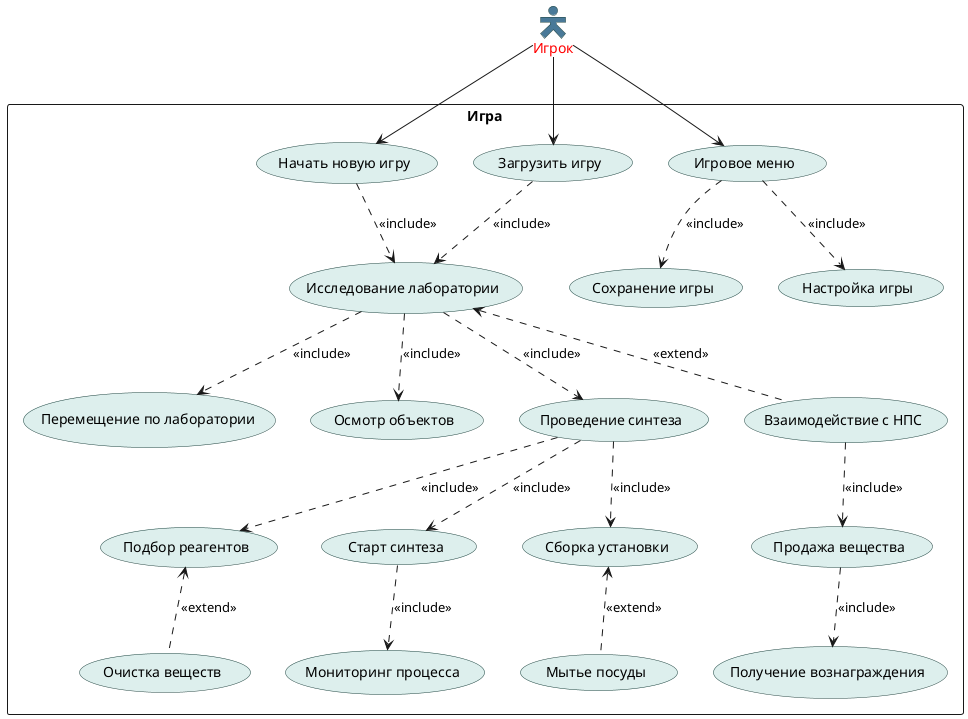

## Код для диаграммы использования

```puml
@startuml     

top to bottom direction   
skinparam packageStyle rectangle   

skinparam actor {   
    Style hollow   
    BackgroundColor #497998   
    BorderColor #214541   
    FontColor red   
}   

skinparam usecase {   
    BackgroundColor #ddefed   
    BorderColor #214541   
    FontColor black   
}   

actor "Игрок" as Player   

rectangle "Игра" {   
    (Начать новую игру) as StartGame   
    (Загрузить игру) as LoadGame 
    (Игровое меню) as GamePause  

    (Исследование лаборатории) as Explore
    (Перемещение по лаборатории) as Move 
    (Осмотр объектов) as Inspect 

    (Проведение синтеза) as Synthesis
    (Сборка установки) as AssemSetup
    (Подбор реагентов) as SelectReag
    (Старт синтеза) as StartSynth
    (Мониторинг процесса) as MonitorProcess

    (Очистка веществ) as CleanReag
    (Мытье посуды) as CleanDishes

    (Взаимодействие с НПС) as NPC 
    (Продажа вещества) as SellObject
    (Получение вознаграждения) as GetReward

    (Сохранение игры) as SaveGame
    (Настройка игры)  as OptionGame

Player --> StartGame   
Player --> LoadGame   
Player --> GamePause   

StartGame ..> Explore : <<include>>   
LoadGame ..> Explore : <<include>> 

Explore ..> Move : <<include>>  
Explore ..> Inspect : <<include>>  
Explore ..> Synthesis : <<include>>  
Explore <.. NPC : <<extend>>  

NPC ..> SellObject : <<include>>  
SellObject ..> GetReward : <<include>>  

Synthesis ..> AssemSetup : <<include>>  
Synthesis ..> SelectReag : <<include>>  
Synthesis ..> StartSynth : <<include>>  
StartSynth ..> MonitorProcess : <<include>>  

SelectReag <.. CleanReag : <<extend>>
AssemSetup <.. CleanDishes : <<extend>>

GamePause ..> SaveGame : <<include>>  
GamePause ..> OptionGame : <<include>>  

@enduml
```