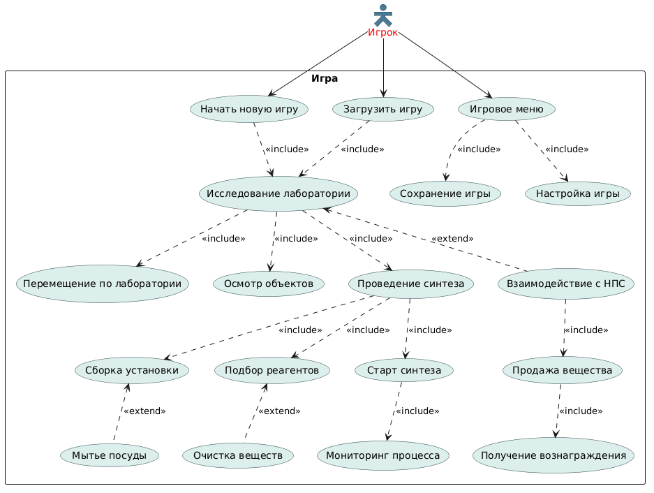
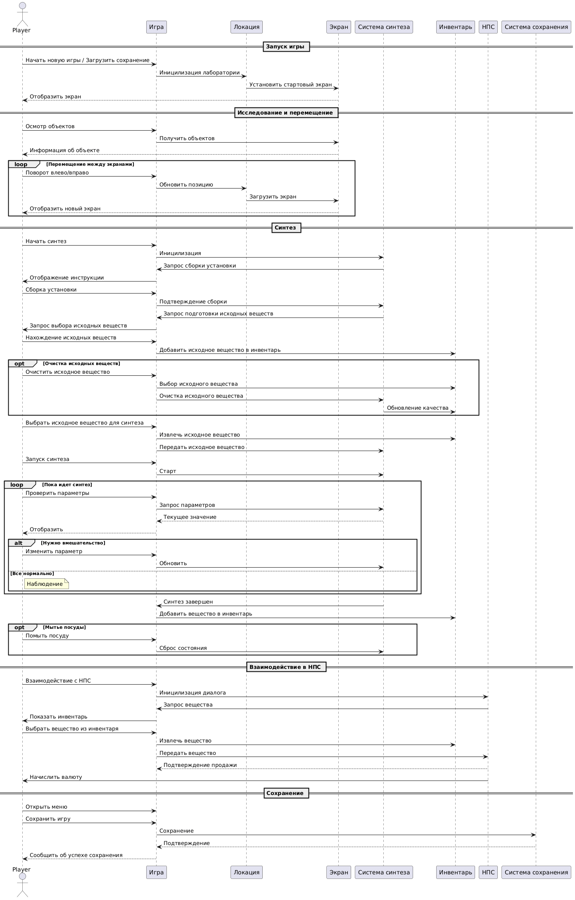
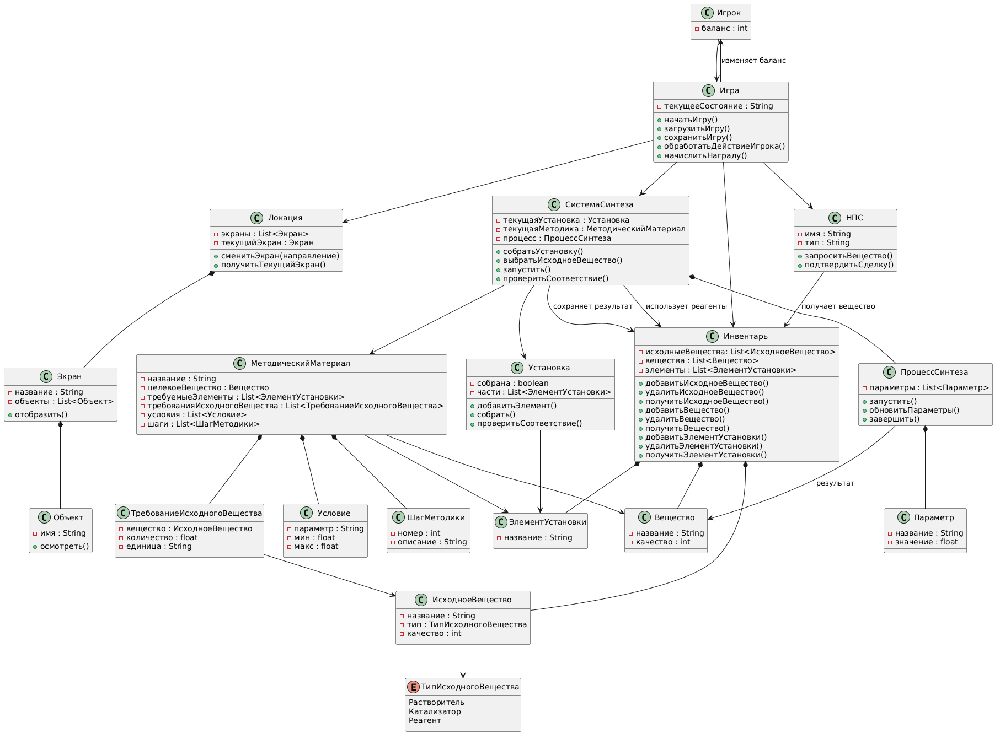
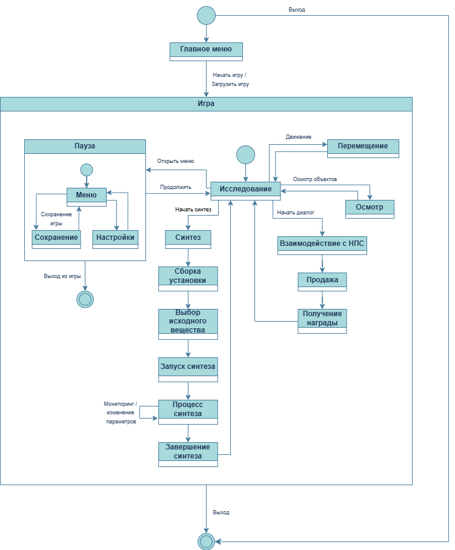

## Диаграммы

Тема ВКР: Разработка 2D-игры на основе Godot Engine

Игра представляет собой симулятор работы химика-синтетика, 
суть которой заключается в том, что игрок по предложенным 
методикам пытается правильно собрать химическую установку 
и получить вещество, за которое получает вознаграждение в 
виде игровой валюты. В зависимости от чистоты полученного вещества, увеличивается вознаграждение.

1. Диаграмма использования

[Код для диаграммы использования](codes/usecase.md)

2. Диаграмма последовательности 

[Код для диаграммы использования](codes/sequence.md)

3. Диаграмма классов

[Код для диаграммы использования](codes/classes.md)

4. Диаграмма состояния

[Код для диаграммы использования](codes/state.md)

## Прототип главного меню игры

